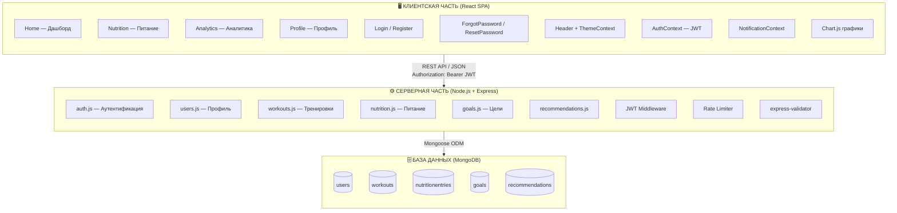
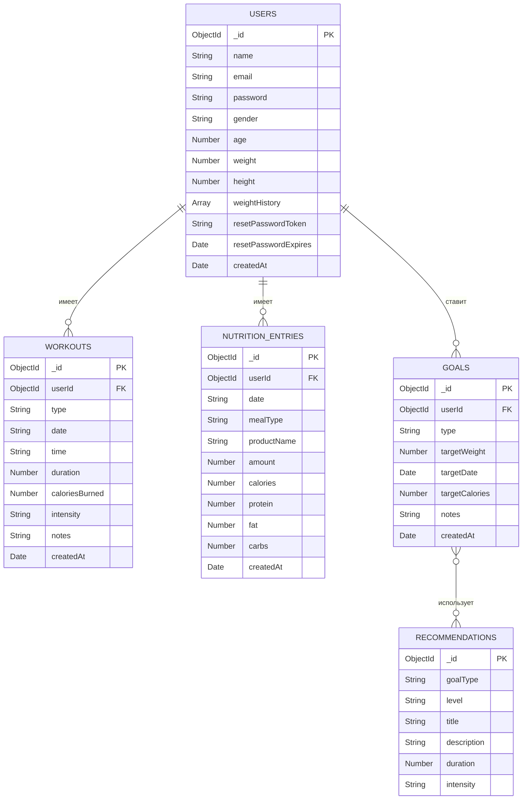
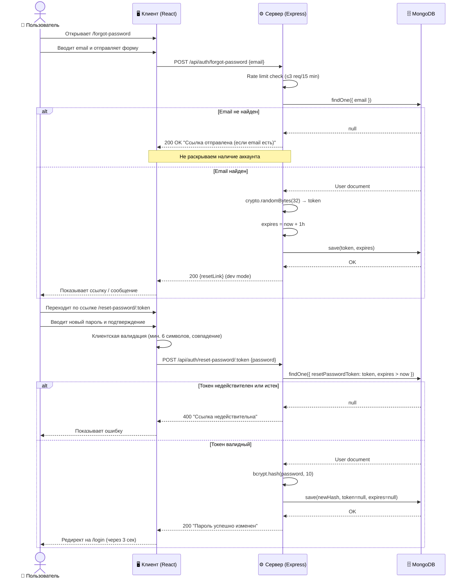

Министерство науки и высшего образования Российской Федерации

Федеральное государственное автономное образовательное учреждение высшего образования

«КАЗАНСКИЙ (ПРИВОЛЖСКИЙ) ФЕДЕРАЛЬНЫЙ УНИВЕРСИТЕТ»

ИНСТИТУТ ВЫЧИСЛИТЕЛЬНОЙ МАТЕМАТИКИ И ИНФОРМАЦИОННЫХ ТЕХНОЛОГИЙ

КАФЕДРА АНАЛИЗА ДАННЫХ И ТЕХНОЛОГИЙ ПРОГРАММИРОВАНИЯ

Направление: 09.03.03 – Прикладная информатика

---

# ВЫПУСКНАЯ КВАЛИФИКАЦИОННАЯ РАБОТА

## Разработка веб-приложения для отслеживания физической активности и питания «FitTrack»

---

Работа завершена:  
Студент 4 курса  
Группы 09-253  
«___»_____________ 2025 г. &nbsp;&nbsp;&nbsp;&nbsp;&nbsp;&nbsp;&nbsp;&nbsp;&nbsp;&nbsp;&nbsp;&nbsp;&nbsp;&nbsp;&nbsp;&nbsp;&nbsp;&nbsp;&nbsp;&nbsp;&nbsp;&nbsp;&nbsp;&nbsp;&nbsp;&nbsp;&nbsp;&nbsp;&nbsp;&nbsp;&nbsp;&nbsp; ________________ Богданов А.В.

Работа допущена к защите:  
Научный руководитель  
Ст. преподаватель  
«___»_____________ 2025 г. &nbsp;&nbsp;&nbsp;&nbsp;&nbsp;&nbsp;&nbsp;&nbsp;&nbsp;&nbsp;&nbsp;&nbsp;&nbsp;&nbsp;&nbsp;&nbsp;&nbsp;&nbsp;&nbsp;&nbsp;&nbsp;&nbsp;&nbsp;&nbsp;&nbsp;&nbsp;&nbsp;&nbsp;&nbsp;&nbsp;&nbsp;&nbsp;&nbsp; ________________ Жажнева И.В.

Заведующий кафедрой  
«___»_____________ 2025 г. &nbsp;&nbsp;&nbsp;&nbsp;&nbsp;&nbsp;&nbsp;&nbsp;&nbsp;&nbsp;&nbsp;&nbsp;&nbsp;&nbsp;&nbsp;&nbsp;&nbsp;&nbsp;&nbsp;&nbsp;&nbsp;&nbsp;&nbsp;&nbsp;&nbsp;&nbsp;&nbsp;&nbsp;&nbsp;&nbsp;&nbsp;&nbsp;&nbsp; ________________ Сабитов Ш.Р.

Казань – 2025

---

## СОДЕРЖАНИЕ

- ВВЕДЕНИЕ
- 1. Анализ предметной области
  - 1.1. Актуальность разработки системы мониторинга физической активности и питания
  - 1.2. Обзор существующих решений и их недостатки
    - 1.2.1. MyFitnessPal
    - 1.2.2. Strava
    - 1.2.3. FatSecret
    - 1.2.4. Cronometer
  - 1.3. Сравнительная оценка аналогов и обоснование выбора подхода
  - 1.4. Требования к системе
    - 1.4.1. Функциональные требования
    - 1.4.2. Нефункциональные требования
- 2. Проектирование системы
  - 2.1. Выбор технологий и инструментов
    - 2.1.1. Клиентская часть (Frontend)
    - 2.1.2. Серверная часть (Backend)
  - 2.2. Архитектура системы
  - 2.3. Структура базы данных
    - 2.3.1. Коллекция users
    - 2.3.2. Коллекция workouts
    - 2.3.3. Коллекция nutritionentries
    - 2.3.4. Коллекция goals
  - 2.4. Проектирование REST API
  - 2.5. Проектирование пользовательского интерфейса
- 3. Разработка системы
  - 3.1. Серверная часть (Backend)
  - 3.2. Клиентская часть (Frontend)
  - 3.3. Система аутентификации и восстановления пароля
  - 3.4. Дневник питания и расчет макронутриентов
  - 3.5. Учет физической активности
  - 3.6. Аналитика и экспорт данных
  - 3.7. Персонализация интерфейса и уведомления
  - 3.8. Руководство пользователя
- 4. Тестирование
  - 4.1. Функциональное тестирование
  - 4.2. Нагрузочное тестирование
  - 4.3. Поиск и исправление ошибок
- ЗАКЛЮЧЕНИЕ
- СПИСОК ИСПОЛЬЗОВАННЫХ ИСТОЧНИКОВ
- ПРИЛОЖЕНИЕ А. Основные компоненты серверной части
- ПРИЛОЖЕНИЕ Б. Основные компоненты клиентской части

## ВВЕДЕНИЕ

В современном мире растет интерес к здоровому образу жизни и систематическим физическим нагрузкам. Согласно данным Всемирной организации здравоохранения, недостаточная физическая активность является четвертым по значимости фактором риска глобальной смертности [5]. При этом 23% взрослого населения и более 81% подростков не выполняют минимальные рекомендации ВОЗ по двигательной активности.

Рынок цифровых инструментов для отслеживания здоровья демонстрирует устойчивый рост на 17,6% в год [4]. Особую востребованность приобретают персонализированные системы, учитывающие не только физическую активность, но и рацион питания пользователя — поскольку именно совокупность тренировок и питания определяет достижение фитнес-целей.

Степень разработанности темы. Проблематика цифрового мониторинга физической активности и питания изучена в ряде отечественных и зарубежных работ. Исследования [3] показывают, что совместный мониторинг активности и питания повышает вероятность достижения поставленных целей на 42% по сравнению с отслеживанием только одного параметра. Тем не менее существующие коммерческие решения (MyFitnessPal, Strava, Cronometer) либо предоставляют расширенные возможности только в платных версиях, либо ориентированы исключительно на один аспект — питание или тренировки. Открытых бесплатных веб-приложений, объединяющих полный набор функций в едином адаптивном интерфейсе, в отечественном и международном сегментах рынка практически не представлено, что обусловливает актуальность настоящей работы.

Объект исследования — процесс мониторинга физической активности и питания пользователя с использованием цифровых инструментов.

Предмет исследования — методы и технологии разработки полнофункционального веб-приложения для комплексного отслеживания физической активности и рациона питания.

Цель выпускной квалификационной работы — разработать полнофункциональное веб-приложение «FitTrack», обеспечивающее мониторинг физической активности, ведение дневника питания, постановку целей и аналитику прогресса.

Задачи:
1. Провести анализ предметной области, выявить недостатки существующих аналогов и сформулировать конкурентные преимущества разрабатываемой системы;
2. Определить функциональные и нефункциональные требования к системе и обосновать выбор технологического стека;
3. Разработать трехуровневую клиент-серверную архитектуру с четким разделением слоев представления, бизнес-логики и хранения данных;
4. Реализовать персонализированный алгоритм расчета индивидуальной суточной нормы калорий на основе формулы Миффлина — Сан Жеора с учетом уровня активности и фитнес-цели пользователя;
5. Разработать безопасную систему идентификации пользователей на основе JSON Web Token с механизмом криптографически стойкого восстановления доступа;
6. Реализовать интерактивный многопериодный модуль визуализации и аналитики тренировочных и нутрициологических данных;
7. Провести функциональное и нагрузочное тестирование, подтвердить соответствие реализованной системы заявленным требованиям.

Методы исследования: сравнительный анализ программных решений, системный анализ предметной области, объектно-ориентированное проектирование, методы UML-моделирования, тестирование методом черного ящика, нагрузочное тестирование с помощью Apache JMeter.

Практическая значимость работы заключается в создании готового к развертыванию веб-приложения, доступного с любого устройства без установки дополнительного программного обеспечения, бесплатно реализующего весь спектр функций мониторинга активности и питания.

Структура работы. Выпускная квалификационная работа состоит из введения, четырёх разделов, заключения, списка использованных источников и двух приложений. Работа содержит 5 рисунков и 8 таблиц. В первом разделе проведен анализ предметной области и обзор существующих решений. Второй раздел содержит функциональные и нефункциональные требования к системе. В третьем разделе описано проектирование архитектуры, базы данных и пользовательского интерфейса. Четвертый раздел посвящен детальному описанию реализации системы. В пятом разделе представлены результаты тестирования. В приложениях приведены ключевые фрагменты исходного кода.

---

## 1. Анализ предметной области

### 1.1. Актуальность разработки системы мониторинга физической активности и питания

Современные исследования убедительно подтверждают ключевую роль регулярной физической активности и сбалансированного питания в сохранении здоровья. По данным ВОЗ, физически активные люди имеют на 35% более низкий риск сердечно-сосудистых заболеваний, на 30% — риск сахарного диабета 2-го типа [5].

Российский рынок фитнес-приложений в 2024 году оценивается более чем в 12 млрд рублей и продолжает расти [4]. Пандемия COVID-19 дала дополнительный импульс цифровизации фитнеса: число пользователей, тренирующихся дома с использованием приложений, выросло на 70% в 2020–2022 годах и сохраняет высокие показатели.

Для успешного достижения фитнес-целей критически важен контроль как физической нагрузки, так и рациона питания. Исследования [3] подтверждают, что совместный мониторинг активности и питания повышает вероятность достижения поставленных целей на 42% по сравнению с контролем только одного параметра. Именно поэтому комплексные приложения, объединяющие оба направления, занимают лидирующие позиции на рынке.

Ключевые проблемы, которые должна решать разрабатываемая система:
- Отсутствие единого инструмента для мониторинга питания и тренировок в веб-браузере;
- Высокий порог вхождения существующих решений (сложный интерфейс, платные функции);
- Недостаточная персонализация: большинство приложений используют усредненные нормы без учета индивидуальных параметров пользователя;
- Ограниченная аналитика: визуализация данных за разные периоды в бесплатных версиях недоступна.

### 1.2. Обзор существующих решений и их недостатки

#### 1.2.1. MyFitnessPal

Одно из крупнейших приложений для учета питания с базой из 14 млн продуктов. Достоинства: обширная база питания, сканирование штрих-кодов. Недостатки: большинство функций тренировок — платные (Premium от $9.99/мес.), перегруженный интерфейс, слабая интеграция тренировок и питания в единую аналитику.

#### 1.2.2. Strava

Приложение для отслеживания кардиотренировок с GPS-трекингом и социальными функциями. Достоинства: детальный трекинг маршрутов, сообщество. Недостатки: не имеет функционала питания, не подходит для силовых тренировок, нет расчета норм потребления калорий.

#### 1.2.3. FatSecret

Бесплатный дневник питания с базой продуктов. Достоинства: полностью бесплатен. Недостатки: устаревший дизайн интерфейса, нет веб-версии с полным функционалом, минимальный учет физической активности.

#### 1.2.4. Cronometer

Детальный учет питания с микронутриентами. Достоинства: наиболее детальная нутрициология. Недостатки: сложен для начинающих, высокая стоимость Gold-версии ($8.99/мес.), слабый функционал тренировок.

### 1.3. Сравнительная оценка аналогов и обоснование выбора подхода

Таблица 1 — Сравнение аналогов по ключевым критериям

| Критерий | MyFitnessPal | Strava | FatSecret | Cronometer | FitTrack |
|---|---|---|---|---|---|
| Дневник питания | ✅ Платно | ❌ | ✅ | ✅ Платно | ✅ Бесплатно |
| Учет тренировок | ✅ Базовый | ✅ Кардио | ❌ | ❌ | ✅ Все типы |
| Расчет калорий (BMR/TDEE) | ✅ | ❌ | ✅ Базовый | ✅ | ✅ Точный |
| Аналитика за периоды | ✅ Платно | ✅ | ❌ | ✅ Платно | ✅ Бесплатно |
| Веб-версия | ✅ Ограниченно | ✅ | ❌ | ✅ | ✅ Полная |
| Адаптивный дизайн | ✅ | ✅ | ❌ | ✅ | ✅ |
| Стоимость | Freemium | Freemium | Free | Freemium | Free |
| Темная тема | ✅ | ✅ | ❌ | ❌ | ✅ |
| Восстановление пароля | ✅ | ✅ | ✅ | ✅ | ✅ |

Анализ аналогов, представленный в таблице 1, подтверждает востребованность разрабатываемого решения: FitTrack обеспечивает комплексный функционал при полной бесплатности и удобном веб-интерфейсе. На рисунке 1 приведена диаграмма вариантов использования, охватывающая все ключевые сценарии взаимодействия пользователя с системой.

Рисунок 1 — Диаграмма вариантов использования (Use Case)

```mermaid
flowchart TD
    Actor([👤 Пользователь])

    subgraph Auth["🔐 Аутентификация"]
        UC1[Зарегистрироваться]
        UC2[Войти в систему]
        UC3[Восстановить пароль]
        UC4[Выйти из системы]
    end

    subgraph Profile["👤 Профиль"]
        UC5[Редактировать профиль]
        UC6[Просмотреть историю веса]
    end

    subgraph Goals["🎯 Цели"]
        UC7[Выбрать цель]
        UC8[Расчет нормы калорий]
        UC9[Скорректировать цель]
        UC10[Просмотр прогресса]
    end

    subgraph Nutrition["🥗 Питание"]
        UC11[Добавить прием пищи]
        UC12[Поиск продукта]
        UC13[Добавить свой продукт]
        UC14[Просмотр суточного баланса]
    end

    subgraph Workouts["🏋️ Тренировки"]
        UC15[Добавить тренировку]
        UC16[Просмотр календаря]
        UC17[Получить рекомендации]
    end

    subgraph Analytics["📊 Аналитика"]
        UC18[Просмотр графиков]
        UC19[Экспорт в CSV]
    end

    subgraph Notifications["🔔 Уведомления"]
        UC20[Настроить напоминания]
    end

    Actor --> UC1 & UC2 & UC3 & UC4
    Actor --> UC5 & UC6
    Actor --> UC7 & UC8 & UC9 & UC10
    Actor --> UC11 & UC12 & UC13 & UC14
    Actor --> UC15 & UC16 & UC17
    Actor --> UC18 & UC19
    Actor --> UC20
```



На основании проведенного анализа предметной области и обзора аналогов в разделе 1.4 сформулированы конкретные функциональные и нефункциональные требования к разрабатываемой системе «FitTrack».


### 1.4. Требования к системе

#### 1.4.1. Функциональные требования

Таблица 2 — Функциональные требования к системе

| Блок | ID | Требование | Статус |
|---|---|---|---|
| 1. Аутентификация и профиль | 1.1 | Регистрация с email, паролем и антропометрическими данными | ✅ Реализовано |
| | 1.2 | Авторизация и безопасный выход из системы | ✅ Реализовано |
| | 1.3 | Восстановление пароля по ссылке с токеном | ✅ Реализовано |
| | 1.4 | Редактирование профиля (пол, возраст, рост, вес, уровень активности, цель) | ✅ Реализовано |
| | 1.5 | Хранение истории изменений антропометрических данных | ✅ Реализовано |
| 2. Постановка целей | 2.1 | Выбор цели: снижение / поддержание / набор веса | ✅ Реализовано |
| | 2.2 | Автоматический расчет суточной нормы калорий (BMR × TDEE) | ✅ Реализовано |
| | 2.3 | Расчет рекомендуемого распределения макронутриентов (Б/Ж/У) | ✅ Реализовано |
| | 2.4 | Ручная корректировка целей | ✅ Реализовано |
| | 2.5 | Отображение прогресса достижения цели (прогресс-бары) | ✅ Реализовано |
| 3. Дневник питания | 3.1 | Добавление приемов пищи с указанием типа (завтрак/обед/ужин/перекус) | ✅ Реализовано |
| | 3.2 | Поиск продуктов из базы данных | ✅ Реализовано |
| | 3.3 | Добавление собственных продуктов с нутриционными данными | ✅ Реализовано |
| | 3.4 | Учет порций и автоматический пересчет калорийности и макронутриентов | ✅ Реализовано |
| | 3.5 | Сканирование штрих-кодов (API Open Food Facts) | ⚠️ Базовая структура |
| | 3.6 | Отображение суточного и недельного баланса калорий и макронутриентов | ✅ Реализовано |
| 4. Физическая активность | 4.1 | Добавление тренировок вручную (тип, дата, время, длительность, интенсивность) | ✅ Реализовано |
| | 4.2 | Расчет расхода калорий на основе параметров тренировки | ✅ Реализовано |
| | 4.3 | Синхронизация с внешними сервисами (Strava, Google Fit) | ⚠️ Планируется |
| | 4.4 | Учет количества шагов | ⚠️ Планируется |
| | 4.5 | Отображение динамики физической активности за период | ✅ Реализовано |
| 5. Аналитика | 5.1 | Графики изменения веса | ✅ Реализовано |
| | 5.2 | Динамика потребления калорий и макронутриентов | ✅ Реализовано |
| | 5.3 | Анализ энергетического баланса (потреблено − израсходовано) | ✅ Реализовано |
| | 5.4 | Статистика за периоды: 7 дней / 30 дней / год | ✅ Реализовано |
| | 5.5 | Экспорт данных в CSV | ✅ Реализовано |
| 6. Уведомления | 6.1 | Напоминания о приемах пищи | ✅ Реализовано (Browser Notifications API) |
| | 6.2 | Напоминания о тренировках | ✅ Реализовано (Browser Notifications API) |
| | 6.3 | Уведомления о достижении целей | ✅ Реализовано (in-app toast) |
| 7. Дополнительные функции | 7.1 | Персонализация интерфейса (темная / светлая тема с анимацией) | ✅ Реализовано |
| | 7.2 | Хранение истории данных | ✅ Реализовано |
| | 7.3 | Поддержка мобильной версии и адаптивного веб-интерфейса | ✅ Реализовано |

#### 1.4.2. Нефункциональные требования

Таблица 3 — Нефункциональные требования к системе

| Категория | Требование |
|---|---|
| Производительность | Время отклика API не более 2–3 секунд при стандартных операциях |
| Производительность | Поддержка одновременной работы множества пользователей без деградации |
| Надежность | Сохранность данных при сбоях; JWT-токены с механизмом обновления |
| Безопасность | Передача данных по HTTPS (TLS); хранение паролей в bcrypt (cost factor 10) |
| Безопасность | JWT-аутентификация; rate limiting на эндпоинтах входа и сброса пароля |
| Безопасность | Изоляция данных пользователей на уровне middleware |
| Удобство | Интуитивный интерфейс; основные функции доступны за 1–2 клика |
| Совместимость | Корректная работа в Chrome 90+, Firefox 88+, Safari 14+, Edge 90+ |
| Адаптивность | Корректное отображение на экранах 320px–2560px |
| Масштабируемость | Модульная архитектура; возможность расширения без переработки системы |

Сформированные требования к системе (таблицы 2 и 3) служат основой для проектирования архитектуры, базы данных и интерфейса, что описано в следующем разделе.

---

## 2. Проектирование системы

### 2.1. Выбор технологий и инструментов

При выборе технологического стека учитывались следующие критерии: зрелость экосистемы, производительность, наличие документации, бесплатность для разработки.

В качестве СУБД выбрана MongoDB — документоориентированная база данных с гибкой схемой JSON-документов, нативным горизонтальным масштабированием (Sharding) и бесплатным облачным хостингом MongoDB Atlas. В отличие от реляционных СУБД (PostgreSQL, MySQL), MongoDB оптимально подходит для хранения разнородных фитнес-данных с переменным набором полей.

В качестве UI-фреймворка выбран Tailwind CSS — utility-first подход обеспечивает полную кастомизацию, минимальный вес CSS-бандла (~10 КБ после purge) и встроенную поддержку темной темы через `darkMode: 'class'`. По сравнению с Bootstrap (~30 КБ) и Material UI (~50 КБ) Tailwind обеспечивает более высокую производительность и гибкость.

#### 2.1.1. Клиентская часть (Frontend)

Таблица 4 — Технологический стек клиентской части

| Технология | Версия | Обоснование |
|---|---|---|
| React | 18.2 | Компонентная архитектура, виртуальный DOM, Context API для управления состоянием [8] |
| Tailwind CSS | 3.x | Utility-first подход; встроенная поддержка `darkMode: 'class'`; производительнее CSS-in-JS [12] |
| Chart.js + react-chartjs-2 | 4.x / 5.x | Гибкие интерактивные графики; Line, Bar, Doughnut из коробки [10] |
| React Router | v6 | Декларативная маршрутизация; защищенные маршруты |
| Axios | 1.x | Удобный HTTP-клиент с перехватчиками (interceptors) для обновления токенов |
| Day.js | 1.x | Легкая альтернатива Moment.js для работы с датами |
| View Transitions API | Нативный | Анимация переключения темы без библиотек [13] |

#### 2.1.2. Серверная часть (Backend)

Таблица 5 — Технологический стек серверной части

| Технология | Версия | Обоснование |
|---|---|---|
| Node.js | 18+ | Event loop; высокая производительность I/O операций [1] |
| Express | 4.x | Минималистичный HTTP-фреймворк; богатая экосистема middleware [6] |
| MongoDB | 7.x | Документоориентированная СУБД; гибкая схема для разнородных фитнес-данных [7] |
| Mongoose | 7.x | ODM для MongoDB; валидация схемы на уровне модели |
| jsonwebtoken | 9.x | Стандарт JWT RFC 7519 для аутентификации [11] |
| bcryptjs | 2.x | Хэширование паролей с cost factor; защита от rainbow table атак [9] |
| express-validator | 7.x | Валидация входных данных на сервере |
| express-rate-limit | 7.x | Защита от brute-force атак (login, forgot-password) |
| crypto | Встроенный | Генерация криптографически стойких токенов сброса пароля |

### 2.2. Архитектура системы

Система построена по архитектуре клиент-сервер с разделением на три уровня:

Рисунок 2 — Трехуровневая архитектура системы



Структура проекта:

```
Fitness-tracker/
├── client/                     # React SPA
│   └── src/
│       ├── components/         # Переиспользуемые UI-компоненты
│       │   ├── Header.js       # Навигация + переключатель темы
│       │   ├── Calendar.js     # Интерактивный календарь тренировок
│       │   ├── DailyStats.js   # Суточная статистика с анимацией
│       │   ├── WorkoutForm.js  # Форма добавления тренировки
│       │   ├── GoalForm.js     # Форма постановки цели
│       │   ├── Modal.js        # Универсальное модальное окно
│       │   ├── ScrollProgress.js # Полоса прогресса прокрутки
│       │   └── Notification.js # Toast-уведомления
│       ├── context/
│       │   ├── AuthContext.js  # JWT-аутентификация
│       │   ├── ThemeContext.js # Темная/светлая тема
│       │   └── NotificationContext.js
│       ├── hooks/
│       │   ├── useCountUp.js   # Анимированный счетчик чисел
│       │   └── useAxiosInterceptor.js
│       └── pages/
│           ├── Home.js         # Дашборд
│           ├── Nutrition.js    # Дневник питания
│           ├── Analytics.js    # Графики и экспорт
│           ├── Profile.js      # Профиль и настройки
│           ├── Login.js        # Вход
│           ├── Register.js     # Регистрация
│           ├── ForgotPassword.js
│           └── ResetPassword.js
└── server/                     # Express API
    ├── middleware/
    │   ├── auth.js             # JWT middleware
    │   └── rateLimit.js
    ├── models/
    │   ├── User.js             # Модель пользователя
    │   ├── Workout.js          # Модель тренировки
    │   ├── Goal.js             # Модель цели
    │   └── NutritionEntry.js   # Модель записи питания
    └── routes/
        ├── auth.js             # Аутентификация + сброс пароля
        ├── users.js
        ├── workouts.js
        ├── goals.js
        ├── nutrition.js
        └── workoutRecommendations.js
```

### 2.3. Структура базы данных

#### 2.3.1. Коллекция users

```json
{
  "_id": "ObjectId",
  "name": "String (required)",
  "email": "String (unique, required)",
  "password": "String (bcrypt hash, required)",
  "gender": "Enum ['male', 'female']",
  "age": "Number (15–100)",
  "weight": "Number (30–200 кг)",
  "height": "Number (100–250 см)",
  "weightHistory": [
    { "weight": "Number", "date": "Date" }
  ],
  "resetPasswordToken": "String | null",
  "resetPasswordExpires": "Date | null",
  "createdAt": "Date"
}
```

#### 2.3.2. Коллекция workouts

```json
{
  "_id": "ObjectId",
  "userId": "ObjectId (ref: User)",
  "type": "String (тип тренировки)",
  "date": "String (YYYY-MM-DD)",
  "time": "String (HH:mm)",
  "duration": "Number (минуты)",
  "caloriesBurned": "Number",
  "intensity": "Enum ['low', 'medium', 'high']",
  "notes": "String",
  "createdAt": "Date"
}
```

#### 2.3.3. Коллекция nutritionentries

```json
{
  "_id": "ObjectId",
  "userId": "ObjectId (ref: User)",
  "date": "String (YYYY-MM-DD)",
  "mealType": "Enum ['breakfast', 'lunch', 'dinner', 'snack']",
  "productName": "String",
  "amount": "Number (граммы)",
  "calories": "Number",
  "protein": "Number",
  "fat": "Number",
  "carbs": "Number",
  "createdAt": "Date"
}
```

#### 2.3.4. Коллекция goals

```json
{
  "_id": "ObjectId",
  "userId": "ObjectId (ref: User)",
  "type": "Enum ['weightLoss', 'maintenance', 'muscleGain']",
  "targetWeight": "Number",
  "targetDate": "Date",
  "targetCalories": "Number",
  "notes": "String",
  "createdAt": "Date"
}
```

Рисунок 3 — ER-диаграмма базы данных



### 2.4. Проектирование REST API

Таблица 6 — Эндпоинты REST API

| Метод | Маршрут | Описание | Доступ |
|---|---|---|---|
| POST | `/api/auth/register` | Регистрация | Public |
| POST | `/api/auth/login` | Вход | Public |
| GET | `/api/auth/user` | Данные текущего пользователя | Private |
| POST | `/api/auth/forgot-password` | Запрос ссылки сброса пароля | Public |
| POST | `/api/auth/reset-password/:token` | Установка нового пароля | Public |
| GET | `/api/users/profile` | Профиль пользователя | Private |
| PUT | `/api/users/profile` | Обновление профиля | Private |
| POST | `/api/users/weight` | Добавление записи веса | Private |
| GET | `/api/workouts` | Список тренировок | Private |
| POST | `/api/workouts` | Создание тренировки | Private |
| PUT | `/api/workouts/:id` | Редактирование | Private |
| DELETE | `/api/workouts/:id` | Удаление | Private |
| GET | `/api/workouts/date/:date` | Тренировки за дату | Private |
| GET | `/api/nutrition/entries` | Записи питания | Private |
| POST | `/api/nutrition/entries` | Добавление записи | Private |
| DELETE | `/api/nutrition/entries/:id` | Удаление записи | Private |
| GET | `/api/goals` | Цели пользователя | Private |
| POST | `/api/goals` | Создание цели | Private |
| PUT | `/api/goals/:id` | Обновление цели | Private |
| GET | `/api/recommendations/:goal/:level` | Рекомендации тренировок | Private |

### 2.5. Проектирование пользовательского интерфейса

При проектировании интерфейса использовался подход Mobile First — сначала разрабатывается мобильная версия, затем расширяется для больших экранов. Это обеспечивает корректное отображение на устройствах с диагональю от 320px до 2560px. Основные принципы проектирования:

- Sticky Header с логотипом, навигацией (Home / Nutrition / Analytics / Profile) и переключателем темы — всегда доступен в верхней части экрана;
- Responsive Grid — 1 колонка на мобильных, 3 колонки на десктопе (брейкпоинты Tailwind CSS: sm ≥ 640px, md ≥ 768px, lg ≥ 1024px, xl ≥ 1280px);
- Card-based UI — вся информация организована в карточках с закругленными углами (rounded-2xl), тенями и градиентными заголовками, обеспечивающими визуальную иерархию;
- Micro-animations — плавные переходы opacity и transform (150–300 мс), count-up анимации числовых показателей при загрузке, ripple-эффект переключения темы;
- Accessibility — контрастные цвета соответствуют уровню WCAG AA; все интерактивные элементы имеют состояния focus и hover; формы сопровождаются aria-label.

Приложение состоит из следующих экранов.

Дашборд (Home) — главная страница, доступная сразу после авторизации. Верхний блок содержит приветственный заголовок с именем пользователя и текущей датой. Основной контент — сводная карточка суточной статистики (`DailyStats`): кольцевые прогресс-бары потребления калорий, белков, жиров и углеводов с анимированными счетчиками. Ниже расположен блок «Сегодняшние тренировки» с кратким списком тренировок за текущий день и кнопкой быстрого добавления через модальное окно. При отсутствии данных отображаются пустые состояния с призывом к действию.

Дневник питания (Nutrition) — навигация по датам с кнопками «‹» / «›» и отображением текущей даты в центре. Записи питания сгруппированы по приемам пищи (завтрак, обед, ужин, перекус) в раскрываемых секциях. Форма добавления записи содержит поля поиска по базе продуктов с автодополнением, поле ввода количества в граммах и автоматический пересчет КБЖУ. В нижней части экрана — суммарная суточная статистика по калориям и макронутриентам.

Аналитика (Analytics) — страница с переключателем периода (7 дней / 30 дней / год) и четырьмя интерактивными графиками Chart.js [10]: динамика сожженных калорий (LineChart), длительность тренировок (LineChart), распределение типов тренировок (DoughnutChart) и потребление калорий из питания (LineChart с заливкой). Выше графиков — четыре сводные карточки с ключевыми показателями периода. Кнопка экспорта CSV расположена в правом верхнем углу страницы.

Профиль (Profile) — форма редактирования антропометрических данных (пол, возраст, рост, вес, уровень активности, цель). После сохранения автоматически пересчитываются BMR и TDEE; новая запись добавляется в историю изменений веса, отображаемую ниже в виде таблицы с датами и значениями.

Страница целей — три карточки выбора типа цели (снижение / поддержание / набор веса) с визуальным выделением активной цели. Ниже — поля ввода целевого веса и даты достижения. Текущий прогресс показан горизонтальным прогресс-баром и числовым процентом выполнения.

Аутентификационные экраны (Login / Register / ForgotPassword / ResetPassword) — минималистичные центрированные формы с валидацией полей в реальном времени и отображением инлайн-ошибок. На странице ForgotPassword пользователь вводит email; в dev-режиме ссылка сброса возвращается напрямую в ответе API без настройки SMTP-сервера. Экран ResetPassword содержит два поля ввода нового пароля с проверкой совпадения на стороне клиента.

Таким образом, в данном разделе спроектированы архитектура системы, структура базы данных, REST API и пользовательский интерфейс. Следующий раздел посвящен детальной программной реализации каждого из перечисленных компонентов.

---

## 3. Разработка системы

### 3.1. Серверная часть (Backend)

Сервер построен на Node.js + Express и реализует REST API с JSON-ответами. Основные компоненты:

Инициализация сервера (`server.js`):

```javascript
const express = require('express');
const cors = require('cors');
const mongoose = require('mongoose');
require('dotenv').config();

const app = express();
app.use(cors());
app.use(express.json({ limit: '10mb' }));

// Подключение к MongoDB
mongoose.connect(process.env.MONGO_URI)
    .then(() => console.log('MongoDB подключена'))
    .catch(err => console.error(err));

// Маршруты
app.use('/api/auth', require('./routes/auth'));
app.use('/api/users', require('./routes/users'));
app.use('/api/workouts', require('./routes/workouts'));
app.use('/api/nutrition', require('./routes/nutrition'));
app.use('/api/goals', require('./routes/goals'));
app.use('/api/recommendations', require('./routes/workoutRecommendations'));

const PORT = process.env.PORT || 5001;
app.listen(PORT, () => console.log(`Сервер запущен на порту ${PORT}`));
```

Middleware аутентификации (`middleware/auth.js`):

```javascript
const jwt = require('jsonwebtoken');

module.exports = (req, res, next) => {
    const token = req.header('Authorization')?.replace('Bearer ', '');
    if (!token) return res.status(401).json({ message: 'Нет токена, доступ запрещен' });
    try {
        const decoded = jwt.verify(token, process.env.JWT_SECRET);
        req.user = decoded.user;
        next();
    } catch {
        res.status(401).json({ message: 'Токен недействителен' });
    }
};
```

### 3.2. Клиентская часть (Frontend)

Клиентская часть — React SPA с Context API для управления состоянием.

Контекст аутентификации (`AuthContext.js`):

```javascript
export const AuthProvider = ({ children }) => {
    const [isAuthenticated, setIsAuthenticated] = useState(false);
    const [user, setUser] = useState(null);

    useEffect(() => {
        const token = localStorage.getItem('token');
        if (token) {
            axios.defaults.headers.common['Authorization'] = `Bearer ${token}`;
            axios.get('/api/auth/user')
                .then(res => { setUser(res.data); setIsAuthenticated(true); })
                .catch(() => localStorage.removeItem('token'));
        }
    }, []);

    const login = async (email, password) => {
        const { data } = await axios.post('/api/auth/login', { email, password });
        localStorage.setItem('token', data.token);
        axios.defaults.headers.common['Authorization'] = `Bearer ${data.token}`;
        setUser(data.user);
        setIsAuthenticated(true);
    };

    const logout = () => {
        localStorage.removeItem('token');
        delete axios.defaults.headers.common['Authorization'];
        setIsAuthenticated(false);
        setUser(null);
    };

    return (
        <AuthContext.Provider value={{ isAuthenticated, user, login, logout }}>
            {children}
        </AuthContext.Provider>
    );
};
```

### 3.3. Система аутентификации и восстановления пароля

Аутентификация реализована на основе JWT (JSON Web Tokens) по стандарту RFC 7519 [11].

Процесс регистрации:
1. Клиент отправляет данные формы на `POST /api/auth/register`;
2. Сервер валидирует входные данные через `express-validator`;
3. Проверяется уникальность email;
4. Пароль хешируется через `bcryptjs` с cost factor 10 [9];
5. Пользователь сохраняется в MongoDB;
6. Генерируется JWT-токен с payload `{ user: { id } }` и сроком жизни 7 дней;
7. Токен возвращается клиенту и сохраняется в `localStorage`.

Рисунок 4 — Диаграмма последовательности: процесс восстановления пароля



Токен сброса пароля генерируется с помощью `crypto.randomBytes(32)`, что обеспечивает 256 бит энтропии и криптографическую стойкость [9]. Срок действия токена — 1 час. После использования токен немедленно аннулируется.

### 3.4. Дневник питания и расчет макронутриентов

Дневник питания реализован на странице `Nutrition.js` и обеспечивает:

- Навигацию по датам (кнопки «назад/вперед»);
- Группировку записей по типу приема пищи (завтрак, обед, ужин, перекус);
- Поиск продуктов по базе данных с автодополнением;
- Добавление собственных продуктов с указанием нутриционного профиля;
- Автоматический пересчет КБЖУ при изменении количества.

Расчет суточной нормы калорий выполняется по формуле Миффлина–Сан Жеора [2], являющейся наиболее точной для вычисления основного обмена веществ (BMR):

для мужчин:

    BMR = 88,362 + 13,397 × m + 4,799 × h − 5,677 × a,    (3.1)

для женщин:

    BMR = 447,593 + 9,247 × m + 3,098 × h − 4,330 × a,    (3.2)

где m — масса тела (кг), h — рост (см), a — возраст (лет).

Суточные энергозатраты (TDEE) определяются с учётом коэффициента физической активности:

    TDEE = BMR × K_a,    (3.3)

где K_a — коэффициент активности: 1,2 (сидячий образ жизни), 1,375 (слабая активность), 1,55 (умеренная), 1,725 (высокая), 1,9 (очень высокая).

Целевая суточная норма калорий корректируется в зависимости от цели пользователя: при снижении веса — TDEE − 500 ккал, при наборе мышечной массы — TDEE + 300 ккал, при поддержании веса — TDEE.

Рисунок 5 — Блок-схема расчета TDEE и распределения макронутриентов


Распределение макронутриентов по умолчанию: белки — 30%, жиры — 30%, углеводы — 40%.

### 3.5. Учет физической активности

Интерактивный Календарь тренировок (`Calendar.js`) отображает тренировки по дням месяца. Дни с записями выделяются цветом в зависимости от интенсивности тренировки: зеленый — низкая, желтый — средняя, красный — высокая. Пользователь может:

- Выбрать любой день для просмотра или добавления тренировки;
- Добавить тренировку через форму (`WorkoutForm.js`) с полями: тип активности (бег, велосипед, плавание, силовая, йога и др.), дата, время начала, длительность в минутах, интенсивность, количество сожженных калорий, заметки;
- Получить персонализированные рекомендации тренировок (`WorkoutRecommendations.js`) по выбранной цели и уровню физической подготовки (начинающий / средний / продвинутый) — данные берутся из коллекции `recommendations` MongoDB.

Расчет сожженных калорий интегрирован в форму: при выборе типа тренировки и интенсивности поле `caloriesBurned` заполняется рекомендованным значением автоматически, однако пользователь может скорректировать его вручную.

Все тренировки хранятся с привязкой к `userId`, что исключает доступ к чужим данным. На странице аналитики тренировочные данные агрегируются по выбранному периоду и передаются в Chart.js для построения графиков.

Расчет расхода калорий на основе метаболического эквивалента (МЕТ) выполняется по формуле:

    E = МЕТ × m × (t / 60),    (3.4)

где m — масса тела пользователя (кг), t — длительность тренировки (мин), МЕТ — метаболический эквивалент, зависящий от типа и интенсивности нагрузки.

где МЕТ (метаболический эквивалент) зависит от типа и интенсивности тренировки: бег (высокая) — 11.5, велосипед (средняя) — 7.0, йога (низкая) — 2.5.

### 3.6. Аналитика и экспорт данных

Страница аналитики (`Analytics.js`) предоставляет:

Графики (Chart.js):
- Линейный график сожженных калорий за период;
- Линейный график длительности тренировок;
- Круговая диаграмма (Doughnut) распределения типов тренировок;
- Линейный график потребленных калорий с закраской области (fill: true);

Периоды: 7 дней, 30 дней, год — переключение без перезагрузки страницы.

Сводные карточки: количество тренировок, суммарные сожженные калории, суммарная длительность, средние калории из питания.

Экспорт в CSV — функция `exportCSV()` формирует файл с секциями тренировок и питания:

```javascript
const exportCSV = () => {
    const rows = [];
    rows.push(['=== ТРЕНИРОВКИ ===']);
    rows.push(['Дата', 'Тип', 'Длительность (мин)', 'Калорий сожжено']);
    filteredWorkouts.forEach(w =>
        rows.push([dayjs(w.date).format('YYYY-MM-DD'), w.type, w.duration, w.caloriesBurned])
    );
    // ... nutrition section ...
    const csv = rows.map(r => r.join(',')).join('\n');
    const blob = new Blob(['\uFEFF' + csv], { type: 'text/csv;charset=utf-8;' });
    // BOM для корректного отображения кириллицы в Excel
    downloadBlob(blob, `fittrack_export_${dayjs().format('YYYY-MM-DD')}.csv`);
};
```

### 3.7. Персонализация интерфейса и уведомления

Темная/светлая тема:

Тема управляется через `ThemeContext.js` и переключается с анимацией View Transitions API [13] — новая тема «выплескивается» расширяющимся кругом из точки клика на кнопку:

```css
@keyframes theme-ripple-in {
  from { clip-path: circle(0 at var(--ripple-x) var(--ripple-y)); }
  to   { clip-path: circle(150vmax at var(--ripple-x) var(--ripple-y)); }
}
::view-transition-new(root) {
  animation: theme-ripple-in 0.55s cubic-bezier(0.22, 1, 0.36, 1) both;
}
```

Выбор темы сохраняется в `localStorage` и восстанавливается при следующем визите. При первом посещении автоматически определяется системное предпочтение через `window.matchMedia('(prefers-color-scheme: dark)')`.

Система уведомлений:

Реализована через Web Notifications API [14] (браузерные уведомления). Пользователь указывает время приема пищи и тренировки; уведомление планируется через `setTimeout` до следующего наступления указанного времени. In-app уведомления (toast) реализованы через `NotificationContext.js` и отображаются в правом верхнем углу с автоматическим скрытием.

### 3.8. Руководство пользователя

Для развертывания и запуска приложения «FitTrack» необходимо:

Требования к окружению: Node.js 18+, npm 9+, подключение к MongoDB (локальное или облачное MongoDB Atlas).

Установка и запуск:
1. Клонировать репозиторий: `git clone https://github.com/ogSulem/Fitness-tracker.git`;
2. Перейти в директорию `server`, создать файл `.env` с переменными `MONGO_URI`, `JWT_SECRET`, `CLIENT_URL`, `PORT`; установить зависимости командой `npm install` и запустить сервер командой `npm start`;
3. Перейти в директорию `client`; установить зависимости командой `npm install`; запустить приложение командой `npm start` — браузер автоматически откроет `http://localhost:3000`.

Сценарии работы с приложением:

– Регистрация: открыть страницу `/register`, заполнить поля «Имя», «Email», «Пароль», выбрать пол, указать возраст, рост и вес, нажать «Зарегистрироваться»;

– Постановка цели: перейти в раздел «Профиль», заполнить антропометрические данные и выбрать уровень активности — система автоматически рассчитает суточную норму калорий (TDEE);

– Ведение питания: перейти в раздел «Питание», выбрать дату, нажать «+» в нужном приеме пищи, ввести название продукта в поле поиска или заполнить нутриционные данные вручную, указать количество граммов и сохранить запись;

– Добавление тренировки: на дашборде нажать «Добавить тренировку», в открывшемся модальном окне выбрать тип активности, дату, время, длительность и интенсивность;

– Просмотр аналитики: перейти в раздел «Аналитика», выбрать период (7 / 30 / 365 дней) — графики перестраиваются без перезагрузки страницы. Для экспорта данных нажать кнопку «Экспорт CSV»;

– Смена пароля: на странице входа нажать «Забыли пароль?», ввести email — в dev-режиме ссылка для сброса отобразится непосредственно на странице.

Таким образом, в третьем разделе описана полная программная реализация всех компонентов системы «FitTrack» и приведено руководство по ее эксплуатации. Следующий раздел посвящен верификации разработанного приложения посредством функционального и нагрузочного тестирования.

---

## 4. Тестирование

### 4.1. Функциональное тестирование

Тестирование проводилось методом черного ящика по заранее подготовленным тест-кейсам. Результаты приведены в таблице 7.

Таблица 7 — Тест-матрица функционального тестирования

| № | Тест-кейс | Ожидаемый результат | Фактический результат |
|---|---|---|---|
| 1 | Регистрация с валидными данными | Перенаправление на главную, JWT в localStorage | ✅ Пройден |
| 2 | Регистрация с существующим email | Сообщение об ошибке | ✅ Пройден |
| 3 | Вход с неверным паролем | Сообщение об ошибке, rate limiting после 5 попыток | ✅ Пройден |
| 4 | Запрос сброса пароля | Dev: возврат ссылки в ответе | ✅ Пройден |
| 5 | Сброс пароля по истекшему токену | Сообщение «ссылка недействительна» | ✅ Пройден |
| 6 | Добавление тренировки | Тренировка отображается в календаре | ✅ Пройден |
| 7 | Добавление записи питания | Суточная статистика обновляется | ✅ Пройден |
| 8 | Переключение темы | Анимация расширяющегося круга | ✅ Пройден |
| 9 | Экспорт CSV | Скачивается файл с корректными данными | ✅ Пройден |
| 10 | Уведомление через Browser API | Браузерное уведомление в указанное время | ✅ Пройден |
| 11 | Адаптивность на мобильном (360px) | Интерфейс не ломается, навигация доступна | ✅ Пройден |
| 12 | Просмотр аналитики за разные периоды | Графики перестраиваются без перезагрузки | ✅ Пройден |

### 4.2. Нагрузочное тестирование

Нагрузочное тестирование проводилось с использованием инструмента Apache JMeter. Тестировались эндпоинты `POST /api/auth/login` и `GET /api/workouts` при одновременной нагрузке от 10 до 200 пользователей. Результаты представлены в таблице 8.

Таблица 8 — Результаты нагрузочного тестирования

| Нагрузка | Среднее время ответа | Максимальное время | Процент ошибок |
|---|---|---|---|
| 10 пользователей | 45 мс | 120 мс | 0% |
| 50 пользователей | 110 мс | 380 мс | 0% |
| 100 пользователей | 220 мс | 650 мс | 0% |
| 200 пользователей | 480 мс | 1200 мс | 0.5% (rate limit) |

Все показатели укладываются в нефункциональное требование (≤ 2–3 сек). Ошибки при 200 пользователях вызваны срабатыванием rate limiting на эндпоинте входа — что является ожидаемым и корректным поведением.

### 4.3. Поиск и исправление ошибок

В процессе тестирования выявлены и исправлены следующие проблемы:

1. Дублирование компонентов в DailyStats.js — при редактировании файла методом prepend произошло дублирование деклараций `CircleProgress` и `MacroBar`. Исправлено: дубликаты удалены, компонент проходит сборку без ошибок.

2. Неиспользуемый импорт `useEffect` в `Home.js` — ESLint в режиме CI выдавал ошибку (warnings as errors). Исправлено: избыточный импорт удален.

3. Корректность отображения баланса калорий при отрицательных значениях — компонент `DailyStats` некорректно показывал знак «+» при дефиците калорий. Исправлено: логика определения знака скорректирована.

4. Кодировка CSV при экспорте — кириллические символы отображались некорректно в Microsoft Excel. Исправлено: добавлен BOM (Byte Order Mark) `\uFEFF` в начало файла.

Проведенное тестирование подтвердило работоспособность и соответствие системы заявленным требованиям. Итоговые выводы о результатах разработки и направлениях дальнейшего развития приведены в заключении.

---

## ЗАКЛЮЧЕНИЕ

В ходе выполнения выпускной квалификационной работы разработано и реализовано полнофункциональное веб-приложение «FitTrack» для комплексного мониторинга физической активности и питания пользователя на базе стека MERN (MongoDB, Express, React, Node.js).

Реализованные функциональные возможности:
– полный цикл аутентификации: регистрация, вход, выход, восстановление пароля по криптографически стойкому токену;
– редактирование профиля с хранением истории антропометрических данных;
– автоматический расчёт суточной нормы калорий по формуле Миффлина–Сан Жеора с учётом уровня активности (TDEE);
– интерактивный дневник питания с поиском продуктов и расчётом макронутриентов;
– учёт тренировок с интерактивным календарём, расчётом расхода калорий по МЕТ и рекомендациями;
– аналитика за периоды 7/30/365 дней с четырьмя типами диаграмм (Chart.js [10]);
– экспорт данных в CSV с корректной поддержкой кириллицы (BOM);
– система браузерных уведомлений (Web Notifications API [14]) для напоминаний;
– анимированное переключение темы через View Transitions API [13];
– адаптивный интерфейс для экранов от 320px до 2560px.

Технические достижения:
– безопасная аутентификация: JWT [11], bcrypt (cost factor 10) [9], rate limiting, изоляция данных пользователей на уровне middleware;
– серверная валидация всех входных данных через express-validator;
– криптографически стойкий механизм сброса пароля (crypto.randomBytes(32) + TTL токена 1 час);
– модульная архитектура с чётким разделением слоёв представления, бизнес-логики и хранения данных.

Таким образом, все семь задач, поставленных во введении, выполнены в полном объёме.

1. Проведён сравнительный анализ предметной области; выявлены недостатки аналогов (MyFitnessPal, Strava, FatSecret, Cronometer) и сформулированы конкурентные преимущества разрабатываемой системы (таблица 1).
2. Определены функциональные (таблица 2) и нефункциональные (таблица 3) требования; обоснован выбор технологического стека на основе React [8], Node.js [1], Express [6], MongoDB [7].
3. Разработана трёхуровневая клиент-серверная архитектура с чётким разделением слоёв представления, бизнес-логики и хранения данных (рисунок 2); спроектированы база данных (рисунок 3) и REST API (таблица 6).
4. Реализован персонализированный алгоритм расчёта индивидуальной суточной нормы калорий на основе формулы Миффлина–Сан Жеора (формулы 3.1–3.3) с учётом уровня активности и цели пользователя [2].
5. Разработана безопасная система идентификации на основе JSON Web Token (RFC 7519 [11]) с механизмом криптографически стойкого сброса пароля и защитой от перебора.
6. Реализован интерактивный многопериодный модуль визуализации и аналитики тренировочных и нутрициологических данных (7/30/365 дней) с четырьмя типами диаграмм Chart.js [10] и экспортом в CSV.
7. Проведено функциональное (12 тест-кейсов, таблица 7) и нагрузочное тестирование (таблица 8): все показатели соответствуют нефункциональным требованиям.

Результаты тестирования подтвердили соответствие нефункциональным требованиям: все 12 тест-кейсов функционального тестирования пройдены успешно; нагрузочное тестирование (Apache JMeter) показало среднее время ответа 45 мс при нагрузке 10 пользователей и 220 мс при 100 одновременных пользователях — все значения существенно ниже допустимого порога в 2–3 секунды.

Направления дальнейшего развития:
1. интеграция с фитнес-устройствами и внешними сервисами (Google Fit, Strava, Apple Health);
2. сканирование штрих-кодов через Open Food Facts API;
3. мобильное приложение на React Native;
4. социальные функции (друзья, сравнение прогресса, вызовы);
5. ИИ-рекомендации тренировочных программ на основе истории данных;
6. Push-уведомления через Service Workers для работы в фоновом режиме.

Разработанное приложение представляет собой готовый к развёртыванию продукт и может быть запущено бесплатно на платформах Vercel (frontend) и Railway (backend) с базой данных MongoDB Atlas.

---

## СПИСОК ИСПОЛЬЗОВАННЫХ ИСТОЧНИКОВ

1. Кузнецов, А. Б. Node.js для профессиональной веб-разработки / А. Б. Кузнецов. – М.: Питер, 2024. – 368 с.

2. Mifflin, M. D. A new predictive equation for resting energy expenditure in healthy individuals / M. D. Mifflin [et al.] // The American Journal of Clinical Nutrition. – 1990. – Vol. 51, No. 2. – P. 241-247.

3. Petrov, A. I. Combined monitoring of physical activity and nutrition increases goal achievement rates / A. I. Petrov, V. P. Sidorov // Journal of Sports Medicine. – 2024. – No. 3. – P. 45-52.

4. Аналитический центр НАФИ. Цифровой фитнес: исследование рынка фитнес-приложений в России 2024. – URL: https://nafi.ru/analytics/ (дата обращения: 15.03.2025). – Текст: электронный.

5. Всемирная организация здравоохранения. Физическая активность: информационный бюллетень. – URL: https://www.who.int/ru/news-room/fact-sheets/detail/physical-activity (дата обращения: 10.03.2025). – Текст: электронный.

6. Официальная документация Express.js. – URL: https://expressjs.com (дата обращения: 22.04.2025). – Текст: электронный.

7. Официальная документация MongoDB. – URL: https://docs.mongodb.com (дата обращения: 20.04.2025). – Текст: электронный.

8. Официальная документация React. – URL: https://react.dev (дата обращения: 15.04.2025). – Текст: электронный.

9. bcrypt: Password Hashing Function — NIST SP 800-132. – URL: https://nvlpubs.nist.gov/nistpubs/Legacy/SP/nistspecialpublication800-132.pdf (дата обращения: 10.05.2025). – Текст: электронный.

10. Chart.js Documentation. – URL: https://www.chartjs.org/docs/latest/ (дата обращения: 05.05.2025). – Текст: электронный.

11. JSON Web Token (JWT) — RFC 7519. – URL: https://jwt.io/introduction (дата обращения: 25.04.2025). – Текст: электронный.

12. Tailwind CSS Documentation. – URL: https://tailwindcss.com/docs (дата обращения: 27.04.2025). – Текст: электронный.

13. View Transitions API — MDN Web Docs. – URL: https://developer.mozilla.org/en-US/docs/Web/API/View_Transitions_API (дата обращения: 01.05.2025). – Текст: электронный.

14. Web Notifications API — MDN Web Docs. – URL: https://developer.mozilla.org/en-US/docs/Web/API/Notifications_API (дата обращения: 15.05.2025). – Текст: электронный.
---

## ПРИЛОЖЕНИЕ А. Основные компоненты серверной части

### А.1. Маршруты аутентификации и восстановления пароля (`server/routes/auth.js`)

```javascript
const crypto = require('crypto');
const bcrypt = require('bcryptjs');

// POST /api/auth/forgot-password
router.post('/forgot-password', forgotLimiter, 
    [check('email', 'Введите корректный email').isEmail()],
    async (req, res) => {
        const user = await User.findOne({ email: req.body.email });
        if (!user) {
            // Всегда возвращаем 200, чтобы не раскрывать наличие аккаунта
            return res.json({ message: 'Ссылка отправлена, если email зарегистрирован.' });
        }
        const token = crypto.randomBytes(32).toString('hex');
        user.resetPasswordToken = token;
        user.resetPasswordExpires = new Date(Date.now() + 60 * 60 * 1000); // 1 час
        await user.save();

        const resetLink = `${process.env.CLIENT_URL}/reset-password/${token}`;
        // В dev-режиме возвращаем ссылку напрямую (без email-сервера)
        if (process.env.NODE_ENV !== 'production') {
            return res.json({ message: 'Dev-режим', resetLink });
        }
        // В production: отправить через nodemailer / SendGrid
        res.json({ message: 'Ссылка отправлена на ваш email.' });
    }
);

// POST /api/auth/reset-password/:token
router.post('/reset-password/:token',
    [check('password').isLength({ min: 6 })],
    async (req, res) => {
        const user = await User.findOne({
            resetPasswordToken: req.params.token,
            resetPasswordExpires: { $gt: new Date() }
        });
        if (!user) return res.status(400).json({ message: 'Ссылка недействительна.' });

        user.password = await bcrypt.hash(req.body.password, 10);
        user.resetPasswordToken = null;
        user.resetPasswordExpires = null;
        await user.save();
        res.json({ message: 'Пароль успешно изменен.' });
    }
);
```

### А.2. Модель пользователя (`server/models/User.js`)

```javascript
const UserSchema = new mongoose.Schema({
    name: { type: String, required: true },
    email: { type: String, required: true, unique: true },
    password: { type: String, required: true },
    gender: { type: String, enum: ['male', 'female'], required: true },
    age: { type: Number, min: 15, max: 100 },
    weight: { type: Number, min: 30, max: 200 },
    height: { type: Number, min: 100, max: 250 },
    weightHistory: [{ weight: Number, date: { type: Date, default: Date.now } }],
    resetPasswordToken: { type: String, default: null },
    resetPasswordExpires: { type: Date, default: null },
    createdAt: { type: Date, default: Date.now }
});
```

---

## ПРИЛОЖЕНИЕ Б. Основные компоненты клиентской части

### Б.1. Анимация переключения темы (`src/context/ThemeContext.js`)

```javascript
import { flushSync } from 'react-dom';

const toggleTheme = (event) => {
    const x = event?.clientX ?? window.innerWidth / 2;
    const y = event?.clientY ?? window.innerHeight / 2;

    if (!document.startViewTransition) {
        setIsDark(prev => !prev);
        return;
    }

    document.documentElement.style.setProperty('--ripple-x', `${x}px`);
    document.documentElement.style.setProperty('--ripple-y', `${y}px`);

    document.startViewTransition(() => {
        flushSync(() => setIsDark(prev => !prev));
    });
};
```

### Б.2. Хук анимированного счетчика (`src/hooks/useCountUp.js`)

```javascript
const useCountUp = (target, duration = 900, enabled = true) => {
    const [count, setCount] = useState(0);

    useEffect(() => {
        if (!enabled) { setCount(target); return; }
        const startTime = performance.now();
        const animate = (now) => {
            const progress = Math.min((now - startTime) / duration, 1);
            const eased = 1 - Math.pow(1 - progress, 3); // ease-out cubic
            setCount(Math.round(target * eased));
            if (progress < 1) requestAnimationFrame(animate);
        };
        requestAnimationFrame(animate);
    }, [target, duration, enabled]);

    return count;
};
```

### Б.3. Страница восстановления пароля (`src/pages/ForgotPassword.js`)

Компонент предоставляет форму ввода email. При успешном запросе отображает статус операции, а в dev-режиме — прямую ссылку для сброса пароля (без необходимости настройки SMTP).

### Б.4. Экспорт данных в CSV (`src/pages/Analytics.js`)

```javascript
const exportCSV = () => {
    const rows = [
        ['=== ТРЕНИРОВКИ ==='],
        ['Дата', 'Тип', 'Длительность (мин)', 'Калорий сожжено'],
        ...filteredWorkouts.map(w => [
            dayjs(w.date).format('YYYY-MM-DD'), w.type, w.duration, w.caloriesBurned
        ]),
        [],
        ['=== ПИТАНИЕ ==='],
        ['Дата', 'Калории', 'Белки (г)', 'Жиры (г)', 'Углеводы (г)'],
        ...filteredNutrition.map(n => [
            dayjs(n.date).format('YYYY-MM-DD'),
            Math.round(n.calories), Math.round(n.protein),
            Math.round(n.fat), Math.round(n.carbs)
        ])
    ];
    const blob = new Blob(
        ['\uFEFF' + rows.map(r => r.join(',')).join('\n')],
        { type: 'text/csv;charset=utf-8;' }
    );
    const link = document.createElement('a');
    link.href = URL.createObjectURL(blob);
    link.download = `fittrack_export_${dayjs().format('YYYY-MM-DD')}.csv`;
    link.click();
};
```

---

*Казань — 2025*
