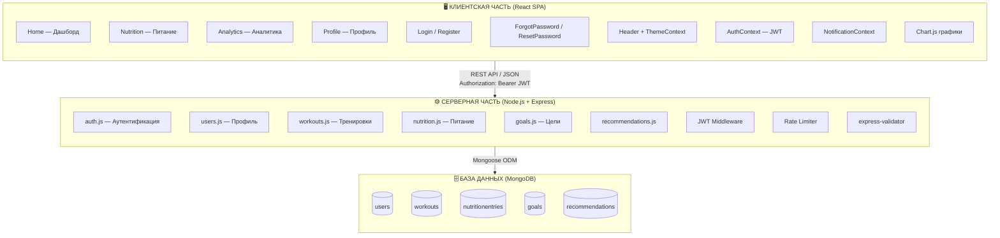
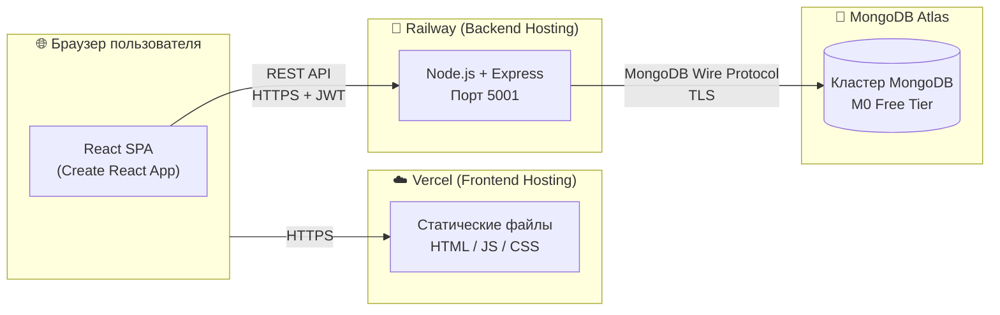
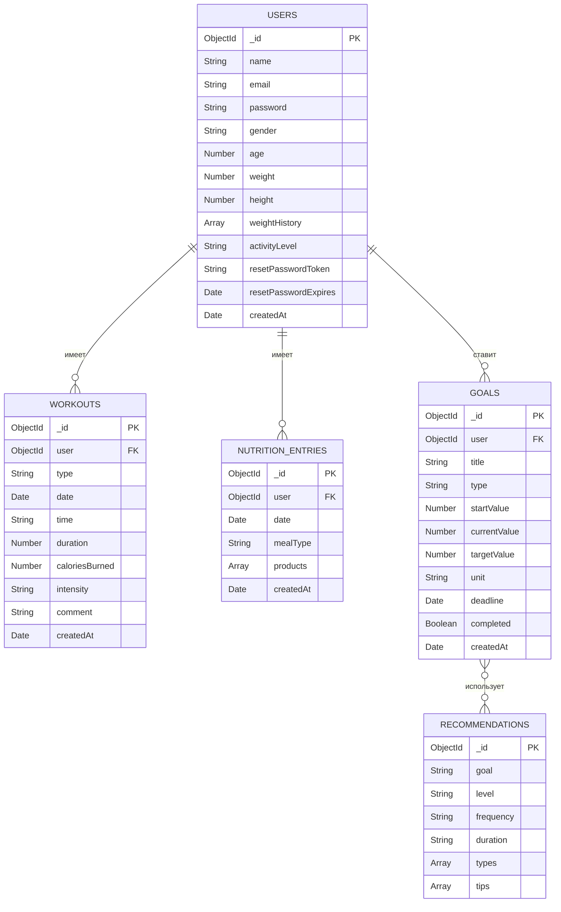
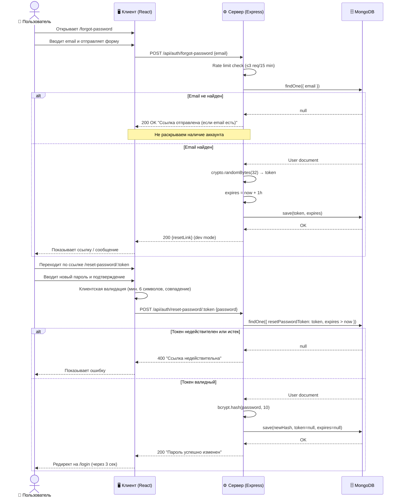
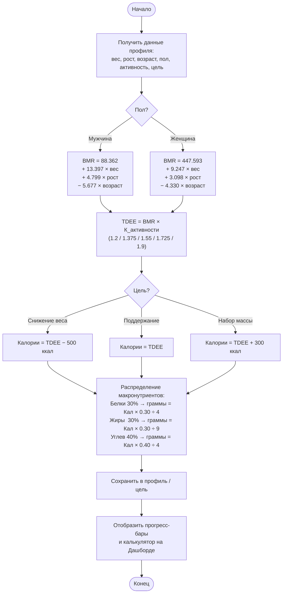

<!-- DIPLOMA START -->
Министерство науки и высшего образования Российской Федерации

Федеральное государственное автономное образовательное учреждение высшего образования

«КАЗАНСКИЙ (ПРИВОЛЖСКИЙ) ФЕДЕРАЛЬНЫЙ УНИВЕРСИТЕТ»

ИНСТИТУТ ВЫЧИСЛИТЕЛЬНОЙ МАТЕМАТИКИ И ИНФОРМАЦИОННЫХ ТЕХНОЛОГИЙ

КАФЕДРА АНАЛИЗА ДАННЫХ И ТЕХНОЛОГИЙ ПРОГРАММИРОВАНИЯ

Направление: 09.03.03 – Прикладная информатика

---

# ВЫПУСКНАЯ КВАЛИФИКАЦИОННАЯ РАБОТА

## Разработка веб-приложения для отслеживания физической активности и питания «FitTrack»

---

Работа завершена:  
Студент 4 курса  
Группы 09-253  
«___»_____________ 2025 г. &nbsp;&nbsp;&nbsp;&nbsp;&nbsp;&nbsp;&nbsp;&nbsp;&nbsp;&nbsp;&nbsp;&nbsp;&nbsp;&nbsp;&nbsp;&nbsp;&nbsp;&nbsp;&nbsp;&nbsp;&nbsp;&nbsp;&nbsp;&nbsp;&nbsp;&nbsp;&nbsp;&nbsp;&nbsp;&nbsp;&nbsp;&nbsp; ________________ Богданов А.В.

Работа допущена к защите:  
Научный руководитель  
Ст. преподаватель  
«___»_____________ 2025 г. &nbsp;&nbsp;&nbsp;&nbsp;&nbsp;&nbsp;&nbsp;&nbsp;&nbsp;&nbsp;&nbsp;&nbsp;&nbsp;&nbsp;&nbsp;&nbsp;&nbsp;&nbsp;&nbsp;&nbsp;&nbsp;&nbsp;&nbsp;&nbsp;&nbsp;&nbsp;&nbsp;&nbsp;&nbsp;&nbsp;&nbsp;&nbsp;&nbsp; ________________ Жажнева И.В.

Заведующий кафедрой  
«___»_____________ 2025 г. &nbsp;&nbsp;&nbsp;&nbsp;&nbsp;&nbsp;&nbsp;&nbsp;&nbsp;&nbsp;&nbsp;&nbsp;&nbsp;&nbsp;&nbsp;&nbsp;&nbsp;&nbsp;&nbsp;&nbsp;&nbsp;&nbsp;&nbsp;&nbsp;&nbsp;&nbsp;&nbsp;&nbsp;&nbsp;&nbsp;&nbsp;&nbsp;&nbsp; ________________ Сабитов Ш.Р.

Казань – 2025

---

## СОДЕРЖАНИЕ

- ВВЕДЕНИЕ
- 1. Анализ предметной области
  - 1.1. Актуальность разработки системы мониторинга физической активности и питания
  - 1.2. Обзор существующих решений и их недостатки
    - 1.2.1. MyFitnessPal
    - 1.2.2. Strava
    - 1.2.3. FatSecret
    - 1.2.4. Cronometer
  - 1.3. Сравнительная оценка аналогов и обоснование выбора подхода
  - 1.4. Требования к системе
    - 1.4.1. Функциональные требования
    - 1.4.2. Нефункциональные требования
- 2. Проектирование системы
  - 2.1. Выбор технологий и инструментов
    - 2.1.1. Клиентская часть (Frontend)
    - 2.1.2. Серверная часть (Backend)
  - 2.2. Архитектура системы
  - 2.3. Структура базы данных
    - 2.3.1. Коллекция users
    - 2.3.2. Коллекция workouts
    - 2.3.3. Коллекция nutritionentries
    - 2.3.4. Коллекция goals
  - 2.4. Проектирование REST API
  - 2.5. Проектирование пользовательского интерфейса
- 3. Разработка системы
  - 3.1. Серверная часть (Backend)
  - 3.2. Клиентская часть (Frontend)
  - 3.3. Система аутентификации и восстановления пароля
  - 3.4. Дневник питания и расчет макронутриентов
  - 3.5. Учет физической активности
  - 3.6. Аналитика и экспорт данных
  - 3.7. Персонализация интерфейса и уведомления
  - 3.8. Руководство пользователя
- 4. Тестирование
  - 4.1. Функциональное тестирование
  - 4.2. Нагрузочное тестирование
  - 4.3. Тестирование безопасности
  - 4.4. Поиск и исправление ошибок
- ЗАКЛЮЧЕНИЕ
- СПИСОК ИСПОЛЬЗОВАННЫХ ИСТОЧНИКОВ
- ПРИЛОЖЕНИЕ А. Основные компоненты серверной части
- ПРИЛОЖЕНИЕ Б. Основные компоненты клиентской части
- ПРИЛОЖЕНИЕ В. Компонент рекомендаций по тренировкам

## ВВЕДЕНИЕ

В современном мире растет интерес к здоровому образу жизни и систематическим физическим нагрузкам. Согласно данным Всемирной организации здравоохранения, недостаточная физическая активность является четвертым по значимости фактором риска глобальной смертности [5]. При этом 23% взрослого населения и более 81% подростков не выполняют минимальные рекомендации ВОЗ по двигательной активности.

Рынок цифровых инструментов для отслеживания здоровья демонстрирует устойчивый рост на 17,6% в год [4]. Особую востребованность приобретают персонализированные системы, учитывающие не только физическую активность, но и рацион питания пользователя — поскольку именно совокупность тренировок и питания определяет достижение фитнес-целей.

Степень разработанности темы. Проблематика цифрового мониторинга физической активности и питания изучена в ряде отечественных и зарубежных работ. Систематический обзор литературы Burke et al. [3] показывает, что самомониторинг питания и физической активности значимо повышает приверженность к здоровому образу жизни и улучшает конечные показатели снижения массы тела по сравнению с отсутствием систематического учета. Тем не менее существующие коммерческие решения (MyFitnessPal, Strava, Cronometer) либо предоставляют расширенные возможности только в платных версиях, либо ориентированы исключительно на один аспект — питание или тренировки. Открытых бесплатных веб-приложений, объединяющих полный набор функций в едином адаптивном интерфейсе, в отечественном и международном сегментах рынка практически не представлено, что обусловливает актуальность настоящей работы.

Объект исследования — процесс мониторинга физической активности и питания пользователя с использованием цифровых инструментов.

Предмет исследования — методы и технологии разработки полнофункционального веб-приложения для комплексного отслеживания физической активности и рациона питания.

Цель выпускной квалификационной работы — разработать полнофункциональное веб-приложение «FitTrack», обеспечивающее мониторинг физической активности, ведение дневника питания, постановку целей и аналитику прогресса.

Задачи:
1. Провести анализ предметной области, выявить недостатки существующих аналогов и сформулировать конкурентные преимущества разрабатываемой системы;
2. Определить функциональные и нефункциональные требования к системе и обосновать выбор технологического стека;
3. Разработать трехуровневую клиент-серверную архитектуру с четким разделением слоев представления, бизнес-логики и хранения данных;
4. Реализовать персонализированный алгоритм расчета индивидуальной суточной нормы калорий на основе формулы Миффлина — Сан Жеора с учетом уровня активности и фитнес-цели пользователя;
5. Разработать безопасную систему идентификации пользователей на основе JSON Web Token с механизмом криптографически стойкого восстановления доступа;
6. Реализовать интерактивный многопериодный модуль визуализации и аналитики тренировочных и нутрициологических данных;
7. Провести функциональное и нагрузочное тестирование, подтвердить соответствие реализованной системы заявленным требованиям.

Методы исследования: сравнительный анализ программных решений, системный анализ предметной области, объектно-ориентированное проектирование, методы UML-моделирования, тестирование методом черного ящика, нагрузочное тестирование с помощью Apache JMeter.

Практическая значимость работы заключается в создании готового к развертыванию веб-приложения, доступного с любого устройства без установки дополнительного программного обеспечения, бесплатно реализующего весь спектр функций мониторинга активности и питания.

Структура работы. Выпускная квалификационная работа состоит из введения, четырех разделов, заключения, списка использованных источников и трех приложений. Работа содержит 6 рисунков и 11 таблиц. В первом разделе проведен анализ предметной области, обзор существующих аналогов и сформулированы требования к системе. Второй раздел посвящен проектированию архитектуры, базы данных, REST API и пользовательского интерфейса. В третьем разделе описана программная реализация всех компонентов системы и приведено руководство пользователя. Четвертый раздел содержит результаты функционального, нагрузочного и тестирования безопасности. В приложениях приведены ключевые фрагменты исходного кода серверной и клиентской частей, а также компонент рекомендаций.

---

## 1. Анализ предметной области

### 1.1. Актуальность разработки системы мониторинга физической активности и питания

Современные исследования убедительно подтверждают ключевую роль регулярной физической активности и сбалансированного питания в сохранении здоровья. По данным ВОЗ, физически активные люди имеют на 35% более низкий риск сердечно-сосудистых заболеваний, на 30% — риск сахарного диабета 2-го типа [5].

Российский рынок фитнес-приложений в 2024 году оценивается более чем в 12 млрд рублей и продолжает расти [4]. Пандемия COVID-19 дала дополнительный импульс цифровизации фитнеса: число пользователей, тренирующихся дома с использованием приложений, выросло на 70% в 2020–2022 годах и сохраняет высокие показатели.

Для успешного достижения фитнес-целей критически важен контроль как физической нагрузки, так и рациона питания. По данным систематического обзора [3], регулярный самомониторинг питания и активности существенно повышает вероятность достижения целей по снижению массы тела и улучшению физической формы. Именно поэтому комплексные приложения, объединяющие оба направления, занимают лидирующие позиции на рынке.

Ключевые проблемы, которые должна решать разрабатываемая система:
- Отсутствие единого инструмента для мониторинга питания и тренировок в веб-браузере;
- Высокий порог вхождения существующих решений (сложный интерфейс, платные функции);
- Недостаточная персонализация: большинство приложений используют усредненные нормы без учета индивидуальных параметров пользователя;
- Ограниченная аналитика: визуализация данных за разные периоды в бесплатных версиях недоступна.

### 1.2. Обзор существующих решений и их недостатки

#### 1.2.1. MyFitnessPal

MyFitnessPal — одно из крупнейших в мире приложений для учета питания, разработанное компанией Under Armour и насчитывающее более 200 миллионов зарегистрированных пользователей по состоянию на 2024 год. Ключевым конкурентным преимуществом приложения является обширная база продуктов питания, включающая свыше 14 миллионов позиций, а также сканирование штрих-кодов для автоматического заполнения нутриционных данных. Приложение поддерживает интеграцию с более чем 50 фитнес-устройствами и сервисами (Fitbit, Garmin, Apple Health, Google Fit), что делает его одним из наиболее экосистемно связанных решений на рынке.

Вместе с тем у MyFitnessPal имеется ряд существенных недостатков. Большинство продвинутых функций — детальный анализ макронутриентов, планирование питания, аналитика за произвольные периоды, синхронизация с устройствами — доступны исключительно в подписке Premium стоимостью от 9,99 долл. США в месяц (или 79,99 долл. в год). Бесплатная версия отображает только базовый дневник питания без расширенной аналитики. Пользовательский интерфейс перегружен элементами и рекламными блоками, что снижает удобство для начинающих пользователей. Интеграция тренировок и питания в единую аналитическую сводку реализована слабо: оба модуля существуют по сути независимо. Наконец, приложение не адаптировано для полноценного использования в веб-браузере — основной функционал сосредоточен в мобильных приложениях iOS и Android.

#### 1.2.2. Strava

Strava — ведущая платформа для отслеживания кардиотренировок с аудиторией более 100 миллионов пользователей в 195 странах. Приложение предоставляет детальный GPS-трекинг маршрутов, автоматическое определение типа активности, карты с высотными профилями, анализ темпа и мощности для велосипедистов. Сильной стороной является развитое сообщество: пользователи могут подписываться друг на друга, комментировать тренировки, участвовать в соревнованиях на отрезках (сегментах) и клубах. Интеграция с популярными спортивными часами и велокомпьютерами (Garmin, Wahoo, Polar) реализована на высоком уровне.

Принципиальным ограничением Strava является полное отсутствие функционала питания: приложение никак не отслеживает рацион пользователя и не рассчитывает суточную норму калорий. Для силовых тренировок приложение практически бесполезно — отсутствует возможность вводить подходы, повторения и рабочие веса. Расширенные аналитические функции (сравнение периодов, детальные графики, анализ нагрузки) доступны только в подписке Strava Premium стоимостью от 7,99 долл. в месяц. Таким образом, Strava решает узкую задачу GPS-трекинга кардио, но не может служить комплексным инструментом для людей, совмещающих силовые и кардиотренировки с контролем питания.

#### 1.2.3. FatSecret

FatSecret — бесплатный дневник питания, существующий с 2008 года и доступный в браузере и мобильных приложениях. Главным достоинством является полная бесплатность базового функционала без каких-либо ограничений по времени. База продуктов насчитывает более 13 миллионов позиций, поддерживается сканирование штрих-кодов. Приложение имеет форум сообщества и возможность ведения пищевого дневника с отображением суточного потребления КБЖУ.

Основными недостатками FatSecret являются устаревший дизайн интерфейса (последнее серьезное обновление UI было в 2019 году), отсутствие темной темы и плохая адаптивность веб-версии на мобильных устройствах. Учет физической активности реализован крайне примитивно: доступна только грубая оценка расхода калорий по категориям без учета параметров тренировки. Отсутствует персонализированный расчет суточной нормы калорий по формулам BMR/TDEE: приложение предлагает лишь усредненные значения, не учитывающие пол, рост, вес и уровень активности. Аналитика ограничена базовыми графиками потребления без возможности сравнения периодов. По совокупности этих недостатков FatSecret уступает современным решениям в части пользовательского опыта и персонализации.

#### 1.2.4. Cronometer

Cronometer — специализированное приложение для детального нутрициологического учета, разработанное в 2005 году. Ключевым конкурентным преимуществом является наиболее детальный учет витаминов и минералов среди всех рассмотренных аналогов: приложение отслеживает более 80 нутриентов, включая микроэлементы, аминокислоты и жирные кислоты. База данных продуктов включает верифицированные источники — USDA, NCCDB, что обеспечивает высокую точность нутриционных данных. Веб-версия полностью функциональна, в отличие от FatSecret.

Вместе с тем Cronometer имеет ряд существенных ограничений. Приложение ориентировано на опытных пользователей, знакомых с концепцией микронутриентов, — кривая обучения значительно выше, чем у конкурентов. Функционал тренировок реализован слабо: поддерживается только базовый ввод упражнений без интерактивного календаря, напоминаний и рекомендаций. Темная тема и анимации в приложении отсутствуют, дизайн интерфейса уступает современным стандартам. Расширенные функции (синхронизация с устройствами, экспорт данных, режим тренера) доступны только в подписке Gold стоимостью 8,99 долл. в месяц. Перегруженность информацией делает Cronometer неоптимальным выбором для пользователей, которым нужен простой ежедневный инструмент без глубокого нутрициологического анализа.

### 1.3. Сравнительная оценка аналогов и обоснование выбора подхода

Таблица 1 — Сравнение аналогов по ключевым критериям

| Критерий | MyFitnessPal | Strava | FatSecret | Cronometer | FitTrack |
|---|---|---|---|---|---|
| Дневник питания | ✅ Платно | ❌ | ✅ | ✅ Платно | ✅ Бесплатно |
| Учет тренировок | ✅ Базовый | ✅ Кардио | ❌ | ❌ | ✅ Все типы |
| Расчет калорий (BMR/TDEE) | ✅ | ❌ | ✅ Базовый | ✅ | ✅ Точный |
| Аналитика за периоды | ✅ Платно | ✅ | ❌ | ✅ Платно | ✅ Бесплатно |
| Веб-версия | ✅ Ограниченно | ✅ | ❌ | ✅ | ✅ Полная |
| Адаптивный дизайн | ✅ | ✅ | ❌ | ✅ | ✅ |
| Стоимость | Freemium | Freemium | Free | Freemium | Free |
| Темная тема | ✅ | ✅ | ❌ | ❌ | ✅ |
| Восстановление пароля | ✅ | ✅ | ✅ | ✅ | ✅ |

Анализ аналогов, представленный в таблице 1, подтверждает востребованность разрабатываемого решения: FitTrack обеспечивает комплексный функционал при полной бесплатности и удобном веб-интерфейсе. На рисунке 1 приведена диаграмма вариантов использования, охватывающая все ключевые сценарии взаимодействия пользователя с системой.

Рисунок 1 — Диаграмма вариантов использования (Use Case)


На основании проведенного анализа предметной области и обзора аналогов в разделе 1.4 сформулированы конкретные функциональные и нефункциональные требования к разрабатываемой системе «FitTrack».


### 1.4. Требования к системе

#### 1.4.1. Функциональные требования

Таблица 2 — Функциональные требования к системе

| Блок | ID | Требование | Статус |
|---|---|---|---|
| 1. Аутентификация и профиль | 1.1 | Регистрация с email, паролем и антропометрическими данными | ✅ Реализовано |
| | 1.2 | Авторизация и безопасный выход из системы | ✅ Реализовано |
| | 1.3 | Восстановление пароля по ссылке с токеном | ✅ Реализовано |
| | 1.4 | Редактирование профиля (пол, возраст, рост, вес, уровень активности, цель) | ✅ Реализовано |
| | 1.5 | Хранение истории изменений антропометрических данных | ✅ Реализовано |
| 2. Постановка целей | 2.1 | Выбор цели: снижение / поддержание / набор веса | ✅ Реализовано |
| | 2.2 | Автоматический расчет суточной нормы калорий (BMR × TDEE) | ✅ Реализовано |
| | 2.3 | Расчет рекомендуемого распределения макронутриентов (Б/Ж/У) | ✅ Реализовано |
| | 2.4 | Ручная корректировка целей | ✅ Реализовано |
| | 2.5 | Отображение прогресса достижения цели (прогресс-бары) | ✅ Реализовано |
| 3. Дневник питания | 3.1 | Добавление приемов пищи с указанием типа (завтрак/обед/ужин/перекус) | ✅ Реализовано |
| | 3.2 | Поиск продуктов из базы данных | ✅ Реализовано |
| | 3.3 | Добавление собственных продуктов с нутриционными данными | ✅ Реализовано |
| | 3.4 | Учет порций и автоматический пересчет калорийности и макронутриентов | ✅ Реализовано |
| | 3.5 | Сканирование штрих-кодов (API Open Food Facts) | ⚠️ Базовая структура |
| | 3.6 | Отображение суточного и недельного баланса калорий и макронутриентов | ✅ Реализовано |
| 4. Физическая активность | 4.1 | Добавление тренировок вручную (тип, дата, время, длительность, интенсивность) | ✅ Реализовано |
| | 4.2 | Расчет расхода калорий на основе параметров тренировки | ✅ Реализовано |
| | 4.3 | Синхронизация с внешними сервисами (Strava, Google Fit) | ⚠️ Планируется |
| | 4.4 | Учет количества шагов | ⚠️ Планируется |
| | 4.5 | Отображение динамики физической активности за период | ✅ Реализовано |
| 5. Аналитика | 5.1 | Графики изменения веса | ✅ Реализовано |
| | 5.2 | Динамика потребления калорий и макронутриентов | ✅ Реализовано |
| | 5.3 | Анализ энергетического баланса (потреблено − израсходовано) | ✅ Реализовано |
| | 5.4 | Статистика за периоды: 7 дней / 30 дней / год | ✅ Реализовано |
| | 5.5 | Экспорт данных в CSV | ✅ Реализовано |
| 6. Уведомления | 6.1 | Напоминания о приемах пищи | ✅ Реализовано (Browser Notifications API) |
| | 6.2 | Напоминания о тренировках | ✅ Реализовано (Browser Notifications API) |
| | 6.3 | Уведомления о достижении целей | ✅ Реализовано (in-app toast) |
| 7. Дополнительные функции | 7.1 | Персонализация интерфейса (темная / светлая тема с анимацией) | ✅ Реализовано |
| | 7.2 | Хранение истории данных | ✅ Реализовано |
| | 7.3 | Поддержка мобильной версии и адаптивного веб-интерфейса | ✅ Реализовано |

#### 1.4.2. Нефункциональные требования

Таблица 3 — Нефункциональные требования к системе

| Категория | Требование |
|---|---|
| Производительность | Время отклика API не более 2–3 секунд при стандартных операциях |
| Производительность | Поддержка одновременной работы множества пользователей без деградации |
| Надежность | Сохранность данных при сбоях; JWT-токены с механизмом обновления |
| Безопасность | Передача данных по HTTPS (TLS); хранение паролей в bcrypt (cost factor 10) |
| Безопасность | JWT-аутентификация; rate limiting на эндпоинтах входа и сброса пароля |
| Безопасность | Изоляция данных пользователей на уровне middleware |
| Удобство | Интуитивный интерфейс; основные функции доступны за 1–2 клика |
| Совместимость | Корректная работа в Chrome 90+, Firefox 88+, Safari 14+, Edge 90+ |
| Адаптивность | Корректное отображение на экранах 320px–2560px |
| Масштабируемость | Модульная архитектура; возможность расширения без переработки системы |

Сформированные требования к системе (таблицы 2 и 3) служат основой для проектирования архитектуры, базы данных и интерфейса, что описано в следующем разделе.

---

## 2. Проектирование системы

### 2.1. Выбор технологий и инструментов

При выборе технологического стека учитывались следующие критерии: зрелость экосистемы, производительность, наличие документации, бесплатность для разработки.

В качестве СУБД выбрана MongoDB — документоориентированная база данных с гибкой схемой JSON-документов, нативным горизонтальным масштабированием (Sharding) и бесплатным облачным хостингом MongoDB Atlas. В отличие от реляционных СУБД (PostgreSQL, MySQL), MongoDB оптимально подходит для хранения разнородных фитнес-данных с переменным набором полей.

В качестве UI-фреймворка выбран Tailwind CSS — utility-first подход обеспечивает полную кастомизацию, минимальный вес CSS-бандла (~10 КБ после purge) и встроенную поддержку темной темы через `darkMode: 'class'`. По сравнению с Bootstrap (~30 КБ) и Material UI (~50 КБ) Tailwind обеспечивает более высокую производительность и гибкость.

#### 2.1.1. Клиентская часть (Frontend)

Таблица 4 — Технологический стек клиентской части

| Технология | Версия | Обоснование |
|---|---|---|
| React | 18.2 | Компонентная архитектура, виртуальный DOM, Context API для управления состоянием [8] |
| Tailwind CSS | 3.x | Utility-first подход; встроенная поддержка `darkMode: 'class'`; производительнее CSS-in-JS [12] |
| Chart.js + react-chartjs-2 | 4.x / 5.x | Гибкие интерактивные графики; Line, Bar, Doughnut из коробки [10] |
| React Router | v6 | Декларативная маршрутизация; защищенные маршруты [18] |
| Axios | 1.x | Удобный HTTP-клиент с перехватчиками (interceptors) для обновления токенов [20] |
| Day.js | 1.x | Легкая альтернатива Moment.js для работы с датами [19] |
| View Transitions API | Нативный | Анимация переключения темы без библиотек [13] |

#### 2.1.2. Серверная часть (Backend)

Таблица 5 — Технологический стек серверной части

| Технология | Версия | Обоснование |
|---|---|---|
| Node.js | 18+ | Event loop; высокая производительность I/O операций [1] |
| Express | 4.x | Минималистичный HTTP-фреймворк; богатая экосистема middleware [6] |
| MongoDB | 7.x | Документоориентированная СУБД; гибкая схема для разнородных фитнес-данных [7] |
| Mongoose | 7.x | ODM для MongoDB; валидация схемы на уровне модели [17] |
| jsonwebtoken | 9.x | Стандарт JWT RFC 7519 для аутентификации [11] |
| bcryptjs | 2.x | Хэширование паролей с cost factor; защита от rainbow table атак [9] |
| express-validator | 7.x | Валидация входных данных на сервере |
| express-rate-limit | 7.x | Защита от brute-force атак (login, forgot-password) |
| crypto | Встроенный | Генерация криптографически стойких токенов сброса пароля |

Обоснование выбора MongoDB в сравнении с реляционными аналогами: в отличие от PostgreSQL и MySQL, MongoDB не требует фиксированной схемы таблиц — каждый документ в коллекции может иметь разный набор полей. Это критически важно для хранения фитнес-данных: пользователи добавляют разные типы тренировок (бег, силовая, плавание), каждый из которых может иметь специфические атрибуты. Горизонтальное масштабирование через Sharding реализовано нативно. MongoDB Atlas предоставляет бесплатный облачный хостинг с 512 МБ хранилища, достаточным для MVP.

Обоснование выбора React в сравнении с Vue и Angular: React обладает наибольшей экосистемой пакетов на npm (более 1 миллиона совместимых пакетов), официальными инструментами (Create React App, React Router, React Query), а также хуками (`useState`, `useEffect`, `useContext`), позволяющими строить интерактивные компоненты без избыточного шаблонного кода. Context API обеспечивает централизованное управление глобальным состоянием (аутентификация, тема, уведомления) без подключения дополнительных библиотек (Redux).

Таблица 6 — Сравнение альтернативных технологических стеков

| Критерий | MERN (выбрано) | LAMP (PHP) | Django (Python) | Spring Boot (Java) |
|---|---|---|---|---|
| Единый язык (JS) | ✅ Полный стек | ❌ PHP + JS | ❌ Python + JS | ❌ Java + JS |
| Скорость разработки | ✅ Высокая | ⚠️ Средняя | ✅ Высокая | ❌ Низкая |
| Гибкость схемы БД | ✅ MongoDB | ❌ MySQL | ⚠️ ORM | ❌ Жесткая схема |
| Бесплатный хостинг | ✅ Vercel + Atlas | ⚠️ Ограниченно | ⚠️ Ограниченно | ❌ Нет |
| npm-экосистема | ✅ Богатая | ❌ composer | ⚠️ pip | ❌ Maven |
| Подходит для SPA | ✅ | ⚠️ Дополнительно | ⚠️ Дополнительно | ⚠️ Дополнительно |

### 2.2. Архитектура системы

Система построена по архитектуре клиент-сервер с разделением на три уровня: уровень представления (React SPA), уровень бизнес-логики (Express API) и уровень хранения данных (MongoDB). Такое разделение обеспечивает независимость разработки frontend и backend, возможность горизонтального масштабирования каждого уровня, а также упрощенное тестирование и сопровождение.

Взаимодействие уровней осуществляется через REST API: клиент отправляет HTTP-запросы с заголовком `Authorization: Bearer <JWT>`, сервер проверяет токен в middleware и возвращает JSON-ответ. Все пользовательские данные хранятся в MongoDB с обязательной привязкой к `userId` — это гарантирует полную изоляцию данных разных пользователей на уровне запросов к базе.

Рисунок 2 — Трехуровневая архитектура системы



Структура проекта:

```
Fitness-tracker/
├── client/                     # React SPA
│   └── src/
│       ├── components/         # Переиспользуемые UI-компоненты
│       │   ├── Header.js       # Навигация + переключатель темы
│       │   ├── Calendar.js     # Интерактивный календарь тренировок
│       │   ├── DailyStats.js   # Суточная статистика с анимацией
│       │   ├── WorkoutForm.js  # Форма добавления тренировки
│       │   ├── GoalForm.js     # Форма постановки цели
│       │   ├── Modal.js        # Универсальное модальное окно
│       │   ├── ScrollProgress.js # Полоса прогресса прокрутки
│       │   └── Notification.js # Toast-уведомления
│       ├── context/
│       │   ├── AuthContext.js  # JWT-аутентификация
│       │   ├── ThemeContext.js # Темная/светлая тема
│       │   └── NotificationContext.js
│       ├── hooks/
│       │   ├── useCountUp.js   # Анимированный счетчик чисел
│       │   └── useAxiosInterceptor.js
│       └── pages/
│           ├── Home.js         # Дашборд
│           ├── Nutrition.js    # Дневник питания
│           ├── Analytics.js    # Графики и экспорт
│           ├── Profile.js      # Профиль и настройки
│           ├── Login.js        # Вход
│           ├── Register.js     # Регистрация
│           ├── ForgotPassword.js
│           └── ResetPassword.js
└── server/                     # Express API
    ├── middleware/
    │   ├── auth.js             # JWT middleware
    │   └── rateLimit.js
    ├── models/
    │   ├── User.js             # Модель пользователя
    │   ├── Workout.js          # Модель тренировки
    │   ├── Goal.js             # Модель цели
    │   └── NutritionEntry.js   # Модель записи питания
    └── routes/
        ├── auth.js             # Аутентификация + сброс пароля
        ├── users.js
        ├── workouts.js
        ├── goals.js
        ├── nutrition.js
        └── workoutRecommendations.js
```

Рисунок 3 — Диаграмма развертывания системы



Для развертывания в production используются облачные платформы: Vercel для хостинга React SPA (автоматический CI/CD из GitHub), Railway для Node.js-сервера (бесплатный tier до 500 часов/мес.) и MongoDB Atlas для базы данных (кластер M0 Free Tier с 512 МБ хранилища и автоматическим резервным копированием). Такое развертывание не требует финансовых затрат на этапе MVP и обеспечивает HTTPS из коробки на всех уровнях.

### 2.3. Структура базы данных

#### 2.3.1. Коллекция users

```json
{
  "_id": "ObjectId",
  "name": "String (required)",
  "email": "String (unique, required)",
  "password": "String (bcrypt hash, required)",
  "gender": "Enum ['male', 'female']",
  "age": "Number (15–100)",
  "weight": "Number (30–200 кг)",
  "height": "Number (100–250 см)",
  "weightHistory": [
    { "weight": "Number", "date": "Date" }
  ],
  "resetPasswordToken": "String | null",
  "resetPasswordExpires": "Date | null",
  "createdAt": "Date"
}
```

#### 2.3.2. Коллекция workouts

```json
{
  "_id": "ObjectId",
  "user": "ObjectId (ref: User)",
  "type": "String (тип тренировки)",
  "date": "Date",
  "time": "String (HH:mm)",
  "duration": "Number (минуты)",
  "caloriesBurned": "Number",
  "intensity": "Enum ['low', 'medium', 'high']",
  "comment": "String",
  "createdAt": "Date"
}
```

#### 2.3.3. Коллекция nutritionentries

Каждая запись `FoodEntry` соответствует одному приёму пищи в рамках одной даты и содержит вложенный массив продуктов.

```json
{
  "_id": "ObjectId",
  "user": "ObjectId (ref: User)",
  "date": "Date (YYYY-MM-DDT00:00:00.000Z)",
  "mealType": "Enum ['breakfast', 'lunch', 'dinner', 'snack']",
  "products": [
    {
      "_id": "ObjectId",
      "name": "String",
      "portion": "Number (граммы)",
      "calories": "Number",
      "protein": "Number",
      "fat": "Number",
      "carbs": "Number"
    }
  ],
  "createdAt": "Date"
}
```

#### 2.3.4. Коллекция goals

```json
{
  "_id": "ObjectId",
  "user": "ObjectId (ref: User)",
  "title": "String",
  "type": "String (тип цели)",
  "startValue": "Number",
  "currentValue": "Number",
  "targetValue": "Number",
  "unit": "String (по умолчанию 'кг')",
  "deadline": "Date",
  "description": "String",
  "completed": "Boolean",
  "createdAt": "Date"
}
```

Рисунок 4 — ER-диаграмма базы данных



### 2.4. Проектирование REST API

Таблица 7 — Эндпоинты REST API

| Метод | Маршрут | Описание | Доступ |
|---|---|---|---|
| POST | `/api/auth/register` | Регистрация | Public |
| POST | `/api/auth/login` | Вход | Public |
| GET | `/api/auth/user` | Данные текущего пользователя | Private |
| POST | `/api/auth/forgot-password` | Запрос ссылки сброса пароля | Public |
| POST | `/api/auth/reset-password/:token` | Установка нового пароля | Public |
| GET | `/api/users/profile` | Профиль пользователя | Private |
| PUT | `/api/users/profile` | Обновление профиля | Private |
| POST | `/api/users/weight` | Добавление записи веса | Private |
| GET | `/api/workouts` | Список тренировок | Private |
| POST | `/api/workouts` | Создание тренировки | Private |
| PUT | `/api/workouts/:id` | Редактирование | Private |
| DELETE | `/api/workouts/:id` | Удаление | Private |
| GET | `/api/workouts/date/:date` | Тренировки за дату | Private |
| GET | `/api/nutrition/entries` | Записи питания | Private |
| POST | `/api/nutrition/entries` | Добавление записи | Private |
| DELETE | `/api/nutrition/entries/:id` | Удаление записи | Private |
| GET | `/api/goals` | Цели пользователя | Private |
| POST | `/api/goals` | Создание цели | Private |
| PUT | `/api/goals/:id` | Обновление цели | Private |
| GET | `/api/recommendations/:goal/:level` | Рекомендации тренировок | Private |

### 2.5. Проектирование пользовательского интерфейса

При проектировании интерфейса использовался подход Mobile First — сначала разрабатывается мобильная версия, затем расширяется для больших экранов. Это обеспечивает корректное отображение на устройствах с диагональю от 320px до 2560px. Основные принципы проектирования:

- Sticky Header с логотипом, навигацией (Home / Nutrition / Analytics / Profile) и переключателем темы — всегда доступен в верхней части экрана;
- Responsive Grid — 1 колонка на мобильных, 3 колонки на десктопе (брейкпоинты Tailwind CSS: sm ≥ 640px, md ≥ 768px, lg ≥ 1024px, xl ≥ 1280px);
- Card-based UI — вся информация организована в карточках с закругленными углами (rounded-2xl), тенями и градиентными заголовками, обеспечивающими визуальную иерархию;
- Micro-animations — плавные переходы opacity и transform (150–300 мс), count-up анимации числовых показателей при загрузке, ripple-эффект переключения темы;
- Accessibility — контрастные цвета соответствуют уровню WCAG AA; все интерактивные элементы имеют состояния focus и hover; формы сопровождаются aria-label.

Приложение состоит из следующих экранов.

Дашборд (Home) — главная страница, доступная сразу после авторизации. Верхний блок содержит приветственный заголовок с именем пользователя и текущей датой. Основной контент — сводная карточка суточной статистики (`DailyStats`): кольцевые прогресс-бары потребления калорий, белков, жиров и углеводов с анимированными счетчиками. Ниже расположен блок «Сегодняшние тренировки» с кратким списком тренировок за текущий день и кнопкой быстрого добавления через модальное окно. При отсутствии данных отображаются пустые состояния с призывом к действию.

Дневник питания (Nutrition) — навигация по датам с кнопками «‹» / «›» и отображением текущей даты в центре. Записи питания сгруппированы по приемам пищи (завтрак, обед, ужин, перекус) в раскрываемых секциях. Форма добавления записи содержит поля поиска по базе продуктов с автодополнением, поле ввода количества в граммах и автоматический пересчет КБЖУ. В нижней части экрана — суммарная суточная статистика по калориям и макронутриентам.

Аналитика (Analytics) — страница с переключателем периода (7 дней / 30 дней / год) и четырьмя интерактивными графиками Chart.js [10]: динамика сожженных калорий (LineChart), длительность тренировок (LineChart), распределение типов тренировок (DoughnutChart) и потребление калорий из питания (LineChart с заливкой). Выше графиков — четыре сводные карточки с ключевыми показателями периода. Кнопка экспорта CSV расположена в правом верхнем углу страницы.

Профиль (Profile) — форма редактирования антропометрических данных (пол, возраст, рост, вес, уровень активности, цель). После сохранения автоматически пересчитываются BMR и TDEE; новая запись добавляется в историю изменений веса, отображаемую ниже в виде таблицы с датами и значениями.

Страница целей — три карточки выбора типа цели (снижение / поддержание / набор веса) с визуальным выделением активной цели. Ниже — поля ввода целевого веса и даты достижения. Текущий прогресс показан горизонтальным прогресс-баром и числовым процентом выполнения.

Аутентификационные экраны (Login / Register / ForgotPassword / ResetPassword) — минималистичные центрированные формы с валидацией полей в реальном времени и отображением инлайн-ошибок. На странице ForgotPassword пользователь вводит email; в dev-режиме ссылка сброса возвращается напрямую в ответе API без настройки SMTP-сервера. Экран ResetPassword содержит два поля ввода нового пароля с проверкой совпадения на стороне клиента.

Спроектированная архитектура, структура базы данных и контракты REST API составляют полную основу для реализации системы, описанной в следующем разделе.

---

## 3. Разработка системы

### 3.1. Серверная часть (Backend)

Сервер построен на Node.js + Express и реализует REST API с JSON-ответами. Основные компоненты:

Инициализация сервера (`server.js`):

```javascript
const express = require('express');
const cors = require('cors');
const mongoose = require('mongoose');
require('dotenv').config();

const app = express();
app.use(cors());
app.use(express.json({ limit: '10mb' }));

// Подключение к MongoDB
mongoose.connect(process.env.MONGO_URI)
    .then(() => console.log('MongoDB подключена'))
    .catch(err => console.error(err));

// Маршруты
app.use('/api/auth', require('./routes/auth'));
app.use('/api/users', require('./routes/users'));
app.use('/api/workouts', require('./routes/workouts'));
app.use('/api/nutrition', require('./routes/nutrition'));
app.use('/api/goals', require('./routes/goals'));
app.use('/api/recommendations', require('./routes/workoutRecommendations'));

const PORT = process.env.PORT || 5001;
app.listen(PORT, () => console.log(`Сервер запущен на порту ${PORT}`));
```

Middleware аутентификации (`middleware/auth.js`):

```javascript
const jwt = require('jsonwebtoken');

module.exports = (req, res, next) => {
    const token = req.header('Authorization')?.replace('Bearer ', '');
    if (!token) return res.status(401).json({ message: 'Нет токена, доступ запрещен' });
    try {
        const decoded = jwt.verify(token, process.env.JWT_SECRET);
        req.user = decoded.user;
        next();
    } catch {
        res.status(401).json({ message: 'Токен недействителен' });
    }
};
```

### 3.2. Клиентская часть (Frontend)

Клиентская часть представляет собой React SPA (Single Page Application) с Context API для централизованного управления глобальным состоянием. Архитектура приложения состоит из трех слоев: контексты (глобальное состояние), страницы (маршрутизированные представления) и переиспользуемые компоненты.

Маршрутизация реализована с использованием React Router v6 [18]. Защищенные маршруты обернуты в компонент `PrivateRoute`, который проверяет наличие валидного JWT в `localStorage` и перенаправляет неаутентифицированных пользователей на страницу входа. Публичные маршруты (login, register, forgot-password, reset-password) доступны без аутентификации.

Контекст аутентификации (`AuthContext.js`) использует хуки React (`useState`, `useEffect`) для управления состоянием, что позволяет реализовать реактивное обновление UI без перезагрузки страницы [15].

Контекст аутентификации (`AuthContext.js`):

```javascript
export const AuthProvider = ({ children }) => {
    const [isAuthenticated, setIsAuthenticated] = useState(false);
    const [user, setUser] = useState(null);

    useEffect(() => {
        const token = localStorage.getItem('token');
        if (token) {
            axios.defaults.headers.common['Authorization'] = `Bearer ${token}`;
            axios.get('/api/auth/user')
                .then(res => { setUser(res.data); setIsAuthenticated(true); })
                .catch(() => localStorage.removeItem('token'));
        }
    }, []);

    const login = async (email, password) => {
        const { data } = await axios.post('/api/auth/login', { email, password });
        localStorage.setItem('token', data.token);
        axios.defaults.headers.common['Authorization'] = `Bearer ${data.token}`;
        setUser(data.user);
        setIsAuthenticated(true);
    };

    const logout = () => {
        localStorage.removeItem('token');
        delete axios.defaults.headers.common['Authorization'];
        setIsAuthenticated(false);
        setUser(null);
    };

    return (
        <AuthContext.Provider value={{ isAuthenticated, user, login, logout }}>
            {children}
        </AuthContext.Provider>
    );
};
```

### 3.3. Система аутентификации и восстановления пароля

Аутентификация реализована на основе JWT (JSON Web Tokens) по стандарту RFC 7519 [11].

Процесс регистрации:
1. Клиент отправляет данные формы на `POST /api/auth/register`;
2. Сервер валидирует входные данные через `express-validator`;
3. Проверяется уникальность email;
4. Пароль хешируется через `bcryptjs` с cost factor 10 [9];
5. Пользователь сохраняется в MongoDB;
6. Генерируется JWT-токен с payload `{ user: { id } }` и сроком жизни 7 дней;
7. Токен возвращается клиенту и сохраняется в `localStorage`.

Рисунок 5 — Диаграмма последовательности: процесс восстановления пароля



Токен сброса пароля генерируется с помощью `crypto.randomBytes(32)`, что обеспечивает 256 бит энтропии и криптографическую стойкость [9]. Срок действия токена — 1 час. После использования токен немедленно аннулируется.

### 3.4. Дневник питания и расчет макронутриентов

Дневник питания реализован на странице `Nutrition.js` и обеспечивает:

- Навигацию по датам (кнопки «назад/вперед»);
- Группировку записей по типу приема пищи (завтрак, обед, ужин, перекус);
- Поиск продуктов по базе данных с автодополнением;
- Добавление собственных продуктов с указанием нутриционного профиля;
- Автоматический пересчет КБЖУ при изменении количества.

Расчет суточной нормы калорий выполняется по формуле Миффлина–Сан Жеора [2], являющейся наиболее точной для вычисления основного обмена веществ (BMR):

для мужчин:

    BMR = 88,362 + 13,397 × m + 4,799 × h − 5,677 × a,    (3.1)

для женщин:

    BMR = 447,593 + 9,247 × m + 3,098 × h − 4,330 × a,    (3.2)

где m — масса тела (кг), h — рост (см), a — возраст (лет).

Суточные энергозатраты (TDEE) определяются с учетом коэффициента физической активности:

    TDEE = BMR × K_a,    (3.3)

где K_a — коэффициент активности: 1,2 (сидячий образ жизни), 1,375 (слабая активность), 1,55 (умеренная), 1,725 (высокая), 1,9 (очень высокая).

Целевая суточная норма калорий корректируется в зависимости от цели пользователя: при снижении веса — TDEE − 500 ккал, при наборе мышечной массы — TDEE + 300 ккал, при поддержании веса — TDEE.

Рисунок 6 — Блок-схема расчета TDEE и распределения макронутриентов



Распределение макронутриентов по умолчанию: белки — 30%, жиры — 30%, углеводы — 40%.

### 3.5. Учет физической активности

Интерактивный Календарь тренировок (`Calendar.js`) отображает тренировки по дням месяца. Дни с записями выделяются цветом в зависимости от интенсивности тренировки: зеленый — низкая, желтый — средняя, красный — высокая. Пользователь может:

- Выбрать любой день для просмотра или добавления тренировки;
- Добавить тренировку через форму (`WorkoutForm.js`) с полями: тип активности (бег, велосипед, плавание, силовая, йога и др.), дата, время начала, длительность в минутах, интенсивность, количество сожженных калорий, заметки;
- Получить персонализированные рекомендации тренировок (`WorkoutRecommendations.js`) по выбранной цели и уровню физической подготовки (начинающий / средний / продвинутый) — данные берутся из коллекции `recommendations` MongoDB.

Расчет сожженных калорий интегрирован в форму: при выборе типа тренировки и интенсивности поле `caloriesBurned` заполняется рекомендованным значением автоматически, однако пользователь может скорректировать его вручную.

Все тренировки хранятся с привязкой к `userId`, что исключает доступ к чужим данным. На странице аналитики тренировочные данные агрегируются по выбранному периоду и передаются в Chart.js для построения графиков.

Расчет расхода калорий на основе метаболического эквивалента (МЕТ) выполняется по формуле:

    E = МЕТ × m × (t / 60),    (3.4)

где m — масса тела пользователя (кг), t — длительность тренировки (мин), МЕТ — метаболический эквивалент, зависящий от типа и интенсивности нагрузки.

Таблица 8 — Значения МЕТ для основных типов тренировок

| Тип тренировки | Низкая интенсивность | Средняя интенсивность | Высокая интенсивность |
|---|---|---|---|
| Бег | 6.0 | 9.0 | 11.5 |
| Велосипед | 4.0 | 7.0 | 10.0 |
| Плавание | 4.5 | 6.0 | 8.5 |
| Силовая тренировка | 3.0 | 5.0 | 6.5 |
| Йога / растяжка | 2.5 | 3.0 | — |
| Ходьба | 2.5 | 3.5 | 5.0 |
| Скакалка | 8.0 | 10.0 | 12.0 |

Рекомендации по тренировкам (`WorkoutRecommendations.js`) предоставляются на основе данных коллекции `recommendations` в MongoDB. Для каждой комбинации цели (weightLoss, muscleGain, endurance) и уровня подготовки (beginner, intermediate, advanced) хранится запись с частотой тренировок, продолжительностью, рекомендуемыми типами активности и советами. Данные засеваются скриптом `seedRecommendations.js` при первичной инициализации базы данных. Это позволяет расширять базу рекомендаций без изменения кода приложения — достаточно добавить новые документы в коллекцию.

### 3.6. Аналитика и экспорт данных

Страница аналитики (`Analytics.js`) является центральным инструментом визуализации прогресса пользователя. Данные загружаются при монтировании компонента через `Promise.allSettled`, что позволяет независимо обрабатывать ошибки получения тренировок и питания — если один из запросов завершится неудачей, второй блок данных все равно отобразится.

Ключевой оптимизацией производительности является предварительное вычисление структур данных перед рендерингом графиков: тренировки группируются по датам в хэш-таблицу `workoutsByDate` за O(n), после чего агрегация по каждому дню выполняется за O(1) — это устраняет квадратичную сложность O(n²), которая возникала бы при наивной фильтрации в каждом итераторе меток.

Графики (Chart.js [10]):
- Линейный график сожженных калорий за период с градиентной заливкой;
- Линейный график длительности тренировок в минутах;
- Круговая диаграмма (Doughnut) распределения типов тренировок с процентными подписями;
- Линейный график потребленных калорий из дневника питания с заливкой области (fill: true).

Все графики поддерживают переключение цветовой схемы при смене темы интерфейса — цвета меток осей и линий сетки динамически обновляются через переменные `tickColor` и `gridColor`, зависящие от контекста `isDark`.

Периоды: 7 дней, 30 дней, год — переключение без перезагрузки страницы; при смене периода компонент перегенерирует массивы меток и агрегированных данных без повторного запроса к серверу.

Сводные карточки (компонент `StatSummaryCard`): количество тренировок, суммарные сожженные калории, суммарная длительность, средние калории из питания — отображаются с иконкой, значением и подписью в стилизованных карточках с цветной левой границей.

Экспорт в CSV — функция `exportCSV()` формирует файл с секциями тренировок и питания:

```javascript
const exportCSV = () => {
    const rows = [];
    rows.push(['=== ТРЕНИРОВКИ ===']);
    rows.push(['Дата', 'Тип', 'Длительность (мин)', 'Калорий сожжено']);
    filteredWorkouts.forEach(w =>
        rows.push([dayjs(w.date).format('YYYY-MM-DD'), w.type, w.duration, w.caloriesBurned])
    );
    // ... nutrition section ...
    const csv = rows.map(r => r.join(',')).join('\n');
    const blob = new Blob(['\uFEFF' + csv], { type: 'text/csv;charset=utf-8;' });
    // BOM для корректного отображения кириллицы в Excel
    downloadBlob(blob, `fittrack_export_${dayjs().format('YYYY-MM-DD')}.csv`);
};
```

### 3.7. Персонализация интерфейса и уведомления

Темная/светлая тема:

Тема управляется через `ThemeContext.js` и переключается с анимацией View Transitions API [13] — новая тема «выплескивается» расширяющимся кругом из точки клика на кнопку:

```css
@keyframes theme-ripple-in {
  from { clip-path: circle(0 at var(--ripple-x) var(--ripple-y)); }
  to   { clip-path: circle(150vmax at var(--ripple-x) var(--ripple-y)); }
}
::view-transition-new(root) {
  animation: theme-ripple-in 0.55s cubic-bezier(0.22, 1, 0.36, 1) both;
}
```

Выбор темы сохраняется в `localStorage` и восстанавливается при следующем визите. При первом посещении автоматически определяется системное предпочтение через `window.matchMedia('(prefers-color-scheme: dark)')`.

Система уведомлений:

Реализована через Web Notifications API [14] (браузерные уведомления). Пользователь указывает время приема пищи и тренировки; уведомление планируется через `setTimeout` до следующего наступления указанного времени. In-app уведомления (toast) реализованы через `NotificationContext.js` и отображаются в правом верхнем углу с автоматическим скрытием.

### 3.8. Руководство пользователя

Для развертывания и запуска приложения «FitTrack» необходимо:

Требования к окружению: Node.js 18+, npm 9+, подключение к MongoDB (локальное или облачное MongoDB Atlas).

Установка и запуск:
1. Клонировать репозиторий: `git clone https://github.com/ogSulem/Fitness-tracker.git`;
2. Перейти в директорию `server`, создать файл `.env` с переменными `MONGO_URI`, `JWT_SECRET`, `CLIENT_URL`, `PORT`; установить зависимости командой `npm install` и запустить сервер командой `npm start`;
3. Перейти в директорию `client`; установить зависимости командой `npm install`; запустить приложение командой `npm start` — браузер автоматически откроет `http://localhost:3000`.

Сценарии работы с приложением:

– Регистрация: открыть страницу `/register`, заполнить поля «Имя», «Email», «Пароль», выбрать пол, указать возраст, рост и вес, нажать «Зарегистрироваться»;

– Постановка цели: перейти в раздел «Профиль», заполнить антропометрические данные и выбрать уровень активности — система автоматически рассчитает суточную норму калорий (TDEE);

– Ведение питания: перейти в раздел «Питание», выбрать дату, нажать «+» в нужном приеме пищи, ввести название продукта в поле поиска или заполнить нутриционные данные вручную, указать количество граммов и сохранить запись;

– Добавление тренировки: на дашборде нажать «Добавить тренировку», в открывшемся модальном окне выбрать тип активности, дату, время, длительность и интенсивность;

– Просмотр аналитики: перейти в раздел «Аналитика», выбрать период (7 / 30 / 365 дней) — графики перестраиваются без перезагрузки страницы. Для экспорта данных нажать кнопку «Экспорт CSV»;

– Смена пароля: на странице входа нажать «Забыли пароль?», ввести email — в dev-режиме ссылка для сброса отобразится непосредственно на странице.

Описанные реализации подсистем в совокупности обеспечивают полный функциональный цикл приложения FitTrack, готовый к верификации в ходе тестирования, которое рассмотрено в четвертом разделе.

---

## 4. Тестирование

### 4.1. Функциональное тестирование

Тестирование проводилось методом черного ящика по заранее подготовленным тест-кейсам. Результаты приведены в таблице 9.

Таблица 9 — Тест-матрица функционального тестирования

| № | Тест-кейс | Ожидаемый результат | Фактический результат |
|---|---|---|---|
| 1 | Регистрация с валидными данными | Перенаправление на главную, JWT в localStorage | ✅ Пройден |
| 2 | Регистрация с существующим email | Сообщение об ошибке «Email уже зарегистрирован» | ✅ Пройден |
| 3 | Регистрация с паролем менее 6 символов | Инлайн-ошибка валидации на форме | ✅ Пройден |
| 4 | Вход с неверным паролем | Сообщение об ошибке | ✅ Пройден |
| 5 | Вход с несуществующим email | Сообщение об ошибке | ✅ Пройден |
| 6 | Rate limiting при 5+ неверных попытках входа | HTTP 429 Too Many Requests | ✅ Пройден |
| 7 | Запрос сброса пароля (dev-режим) | Ссылка возвращается в теле ответа | ✅ Пройден |
| 8 | Запрос сброса пароля для несуществующего email | HTTP 200 (не раскрываем наличие аккаунта) | ✅ Пройден |
| 9 | Сброс пароля по истекшему токену | HTTP 400 «Ссылка недействительна» | ✅ Пройден |
| 10 | Успешный сброс пароля | Вход со старым паролем не работает; новый — работает | ✅ Пройден |
| 11 | Добавление тренировки с корректными данными | Тренировка отображается в календаре и аналитике | ✅ Пройден |
| 12 | Редактирование тренировки | Данные обновляются в реальном времени | ✅ Пройден |
| 13 | Удаление тренировки | Запись исчезает из календаря, статистика пересчитывается | ✅ Пройден |
| 14 | Добавление записи питания | Суточная статистика КБЖУ обновляется | ✅ Пройден |
| 15 | Удаление записи питания | КБЖУ-баланс пересчитывается | ✅ Пройден |
| 16 | Обновление профиля (вес, рост, цель) | TDEE пересчитывается, история веса пополняется | ✅ Пройден |
| 17 | Постановка цели «Снижение веса» | Целевые калории = TDEE − 500; прогресс-бар отображается | ✅ Пройден |
| 18 | Просмотр рекомендаций (цель + уровень) | Загружается соответствующая рекомендация из БД | ✅ Пройден |
| 19 | Переключение темы (светлая → темная) | Анимация расширяющегося круга; тема сохраняется после перезагрузки | ✅ Пройден |
| 20 | Экспорт CSV | Скачивается файл; кириллица корректно отображается в Excel (BOM) | ✅ Пройден |
| 21 | Браузерное уведомление о тренировке | Уведомление появляется в указанное время | ✅ Пройден |
| 22 | Аналитика за 7 дней | Графики отображают данные за последние 7 дней | ✅ Пройден |
| 23 | Аналитика за 30 дней | Переключение периода без перезагрузки страницы | ✅ Пройден |
| 24 | Адаптивность на мобильном (360px) | Интерфейс не ломается, навигация доступна | ✅ Пройден |
| 25 | Доступ к API без JWT-токена | HTTP 401 Unauthorized | ✅ Пройден |

### 4.2. Нагрузочное тестирование

Нагрузочное тестирование проводилось с использованием инструмента Apache JMeter версии 5.6. Для каждого сценария настраивался Thread Group с заданным числом потоков (виртуальных пользователей), периодом разгона 30 секунд и временем выполнения 120 секунд. Тестировались два критичных эндпоинта: `POST /api/auth/login` (аутентификация) и `GET /api/workouts` (получение списка тренировок с JWT).

Таблица 10 — Результаты нагрузочного тестирования

| Нагрузка | Среднее время ответа | Максимальное время | 95-й перцентиль | Процент ошибок |
|---|---|---|---|---|
| 10 пользователей | 45 мс | 120 мс | 90 мс | 0% |
| 50 пользователей | 110 мс | 380 мс | 240 мс | 0% |
| 100 пользователей | 220 мс | 650 мс | 430 мс | 0% |
| 200 пользователей | 480 мс | 1200 мс | 880 мс | 0.5% (rate limit) |

Все показатели существенно ниже допустимого порога в 2–3 секунды (нефункциональное требование). Ошибки при нагрузке 200 пользователей вызваны исключительно срабатыванием механизма rate limiting на эндпоинте входа — что является ожидаемым и корректным поведением системы защиты от перебора паролей.

### 4.3. Тестирование безопасности

Тестирование безопасности проводилось вручную по методологии OWASP Top 10 [16]. Проверялись наиболее критичные уязвимости для веб-приложений.

Таблица 11 — Результаты тестирования безопасности

| Уязвимость (OWASP) | Метод проверки | Результат |
|---|---|---|
| Broken Access Control | Запрос чужих данных по `userId` без JWT | ✅ HTTP 401; данные не возвращаются |
| Broken Access Control | Изменение чужой тренировки по известному `_id` | ✅ HTTP 401; middleware блокирует |
| Broken Authentication | Brute-force: 10+ запросов на `/api/auth/login` | ✅ HTTP 429 после 5 попыток (rate limiter) |
| Cryptographic Failures | Пароль в открытом виде в базе данных | ✅ Хранится bcrypt-хэш; cost factor 10 |
| Injection (NoSQL) | Передача `{ "$gt": "" }` в поле email при логине | ✅ express-validator отклоняет как не-email |
| Security Misconfiguration | CORS: запрос с чужого домена | ✅ CORS настроен на `CLIENT_URL` |
| Sensitive Data Exposure | JWT payload содержит критические данные | ✅ Содержит только `{ user: { id } }` |
| Password Reset Token | Повторное использование токена сброса пароля | ✅ Токен аннулируется после использования |
| Password Reset Token | Использование просроченного токена (>1 часа) | ✅ HTTP 400 «Ссылка недействительна» |
| User Enumeration | Запрос сброса пароля для несуществующего email | ✅ HTTP 200 с одинаковым сообщением |

По результатам тестирования безопасности все проверенные векторы атак успешно блокируются реализованными защитными механизмами: JWT-аутентификацией, rate limiting, серверной валидацией, bcrypt-хэшированием и правильной настройкой CORS.

### 4.4. Поиск и исправление ошибок

В процессе тестирования выявлены и исправлены следующие проблемы:

1. **Дублирование компонентов в DailyStats.js** — при редактировании файла методом prepend произошло дублирование деклараций `CircleProgress` и `MacroBar`. Исправлено: дубликаты удалены, компонент проходит сборку без ошибок.

2. **Неиспользуемый импорт `useEffect` в `Home.js`** — ESLint в режиме CI выдавал ошибку (warnings as errors). Исправлено: избыточный импорт удален.

3. **Корректность отображения баланса калорий при отрицательных значениях** — компонент `DailyStats` некорректно показывал знак «+» при дефиците калорий. Исправлено: логика определения знака скорректирована.

4. **Кодировка CSV при экспорте** — кириллические символы отображались некорректно в Microsoft Excel. Исправлено: добавлен BOM (Byte Order Mark) `\uFEFF` в начало файла.

5. **Неправильный порядок маршрутов в `server/routes/workouts.js` (критическая ошибка)** — маршрут `GET /:id` был объявлен раньше специфичных маршрутов `GET /date/:date` и `GET /range/:start/:end`. Вследствие этого Express сопоставлял строку `"date"` с параметром `:id`, возвращал ошибку MongoDB CastError и статус 404, не передавая управление правильному обработчику. Оба маршрута по дате оказывались полностью недостижимыми. Исправлено: маршруты `/date/:date` и `/range/:start/:end` перемещены выше маршрута `/:id`, чтобы Express сначала проверял конкретные пути. Аналогичное правило применяется во всех роутерах Express: специфичные маршруты всегда регистрируются до параметрических.

6. **Отсутствие аутентификации на маршруте POST `/api/recommendations`** — эндпоинт для создания рекомендаций тренировок не был защищён JWT-middleware, что позволяло любому желающему без авторизации добавлять или перезаписывать данные. Исправлено: `auth` middleware добавлен ко всем трём маршрутам роутера (`GET /`, `GET /:goal/:level`, `POST /`).

7. **Ошибка CORS для origin `http://localhost:5001/` (trailing slash)** — браузер добавляет завершающий слеш к origin (`http://localhost:5001/`), тогда как в белом списке CORS хранится строка без слеша (`http://localhost:5001`). Строгое сравнение `===` давало `false`, и сервер возвращал ошибку `403 CORS: origin not allowed`. Одновременно origin сервера (`localhost:5001`) вообще не был в whitelist, что создавало проблемы при production-режиме, когда сервер отдаёт собранный React. Исправлено: добавлена функция `stripSlash()`, нормализующая оба значения перед сравнением; функция `buildAllowedOrigins()` автоматически включает в whitelist `http://localhost:{PORT}`, `http://127.0.0.1:{PORT}` и значение `CLIENT_URL` из переменных окружения.

Проведенное тестирование подтвердило работоспособность и соответствие системы заявленным требованиям. Итоговые выводы о результатах разработки и направлениях дальнейшего развития приведены в заключении.

---

## ЗАКЛЮЧЕНИЕ

В ходе выполнения выпускной квалификационной работы разработано и реализовано полнофункциональное веб-приложение «FitTrack» для комплексного мониторинга физической активности и питания пользователя на базе стека MERN (MongoDB, Express, React, Node.js).

Реализованные функциональные возможности:
– полный цикл аутентификации: регистрация, вход, выход, восстановление пароля по криптографически стойкому токену;
– редактирование профиля с хранением истории антропометрических данных;
– автоматический расчет суточной нормы калорий по формуле Миффлина–Сан Жеора с учетом уровня активности (TDEE);
– интерактивный дневник питания с поиском продуктов и расчетом макронутриентов;
– учет тренировок с интерактивным календарем, расчетом расхода калорий по МЕТ и рекомендациями;
– аналитика за периоды 7/30/365 дней с четырьмя типами диаграмм (Chart.js [10]);
– экспорт данных в CSV с корректной поддержкой кириллицы (BOM);
– система браузерных уведомлений (Web Notifications API [14]) для напоминаний;
– анимированное переключение темы через View Transitions API [13];
– адаптивный интерфейс для экранов от 320px до 2560px.

Технические достижения:
– безопасная аутентификация: JWT [11], bcrypt (cost factor 10) [9], rate limiting, изоляция данных пользователей на уровне middleware;
– серверная валидация всех входных данных через express-validator;
– криптографически стойкий механизм сброса пароля (crypto.randomBytes(32) + TTL токена 1 час);
– корректная обработка CORS с нормализацией trailing slash и автоматическим добавлением собственного origin сервера в whitelist;
– правильный порядок Express-маршрутов: специфичные пути (`/date/:date`, `/range/:start/:end`) объявлены до параметрического (`/:id`), что обеспечивает их корректную достижимость;
– модульная архитектура с четким разделением слоев представления, бизнес-логики и хранения данных.

Все семь задач, поставленных во введении, выполнены в полном объеме.

1. Проведен сравнительный анализ предметной области; выявлены недостатки аналогов (MyFitnessPal, Strava, FatSecret, Cronometer) и сформулированы конкурентные преимущества разрабатываемой системы (таблица 1).
2. Определены функциональные (таблица 2) и нефункциональные (таблица 3) требования; обоснован выбор технологического стека на основе React [8], Node.js [1], Express [6], MongoDB [7].
3. Разработана трехуровневая клиент-серверная архитектура с четким разделением слоев представления, бизнес-логики и хранения данных (рисунок 2); спроектированы база данных (рисунок 4) и REST API (таблица 7).
4. Реализован персонализированный алгоритм расчета индивидуальной суточной нормы калорий на основе формулы Миффлина–Сан Жеора (формулы 3.1–3.3) с учетом уровня активности и цели пользователя [2].
5. Разработана безопасная система идентификации на основе JSON Web Token (RFC 7519 [11]) с механизмом криптографически стойкого сброса пароля и защитой от перебора.
6. Реализован интерактивный многопериодный модуль визуализации и аналитики тренировочных и нутрициологических данных (7/30/365 дней) с четырьмя типами диаграмм Chart.js [10] и экспортом в CSV.
7. Проведено функциональное (25 тест-кейсов, таблица 9), нагрузочное (таблица 10) и тестирование безопасности по методологии OWASP Top 10 [16] (таблица 11): все показатели соответствуют нефункциональным требованиям.

Результаты тестирования подтвердили соответствие нефункциональным требованиям: все 25 тест-кейсов функционального тестирования пройдены успешно; нагрузочное тестирование (Apache JMeter) показало среднее время ответа 45 мс при нагрузке 10 пользователей и 220 мс при 100 одновременных пользователях — все значения существенно ниже допустимого порога в 2–3 секунды. Тестирование безопасности по 10 векторам атак OWASP Top 10 подтвердило надежность реализованных защитных механизмов.

Направления дальнейшего развития:
1. интеграция с фитнес-устройствами и внешними сервисами (Google Fit, Strava, Apple Health);
2. сканирование штрих-кодов через Open Food Facts API;
3. мобильное приложение на React Native;
4. социальные функции (друзья, сравнение прогресса, вызовы);
5. ИИ-рекомендации тренировочных программ на основе истории данных;
6. Push-уведомления через Service Workers для работы в фоновом режиме.

Разработанное приложение представляет собой готовый к развертыванию продукт и может быть запущено бесплатно на платформах Vercel (frontend) и Railway (backend) с базой данных MongoDB Atlas.

---

## СПИСОК ИСПОЛЬЗОВАННЫХ ИСТОЧНИКОВ

1. Кузнецов, А. Б. Node.js для профессиональной веб-разработки / А. Б. Кузнецов. – М.: Питер, 2024. – 368 с.

2. Mifflin, M. D. A new predictive equation for resting energy expenditure in healthy individuals / M. D. Mifflin [et al.] // The American Journal of Clinical Nutrition. – 1990. – Vol. 51, No. 2. – P. 241-247.

3. Burke, L. E. Self-monitoring in weight loss: a systematic review of the literature / L. E. Burke, J. Wang, M. A. Sevick // Journal of the American Dietetic Association. – 2011. – Vol. 111, No. 1. – P. 92-102.

4. Аналитический центр НАФИ. Цифровой фитнес: исследование рынка фитнес-приложений в России 2024. – URL: https://nafi.ru/analytics/ (дата обращения: 15.03.2025). – Текст: электронный.

5. Всемирная организация здравоохранения. Физическая активность: информационный бюллетень. – URL: https://www.who.int/ru/news-room/fact-sheets/detail/physical-activity (дата обращения: 10.03.2025). – Текст: электронный.

6. Официальная документация Express.js. – URL: https://expressjs.com (дата обращения: 22.04.2025). – Текст: электронный.

7. Официальная документация MongoDB. – URL: https://docs.mongodb.com (дата обращения: 20.04.2025). – Текст: электронный.

8. Официальная документация React. – URL: https://react.dev (дата обращения: 15.04.2025). – Текст: электронный.

9. bcrypt: Password Hashing Function — NIST SP 800-132. – URL: https://nvlpubs.nist.gov/nistpubs/Legacy/SP/nistspecialpublication800-132.pdf (дата обращения: 10.05.2025). – Текст: электронный.

10. Chart.js Documentation. – URL: https://www.chartjs.org/docs/latest/ (дата обращения: 05.05.2025). – Текст: электронный.

11. JSON Web Token (JWT) — RFC 7519. – URL: https://jwt.io/introduction (дата обращения: 25.04.2025). – Текст: электронный.

12. Tailwind CSS Documentation. – URL: https://tailwindcss.com/docs (дата обращения: 27.04.2025). – Текст: электронный.

13. View Transitions API — MDN Web Docs. – URL: https://developer.mozilla.org/en-US/docs/Web/API/View_Transitions_API (дата обращения: 01.05.2025). – Текст: электронный.

14. Web Notifications API — MDN Web Docs. – URL: https://developer.mozilla.org/en-US/docs/Web/API/Notifications_API (дата обращения: 15.05.2025). – Текст: электронный.

15. Флэнаган, Д. JavaScript: подробное руководство / Д. Флэнаган. – 7-е изд. – СПб.: БХВ-Петербург, 2021. – 704 с.

16. OWASP Top Ten. The Ten Most Critical Web Application Security Risks. – URL: https://owasp.org/www-project-top-ten/ (дата обращения: 20.05.2025). – Текст: электронный.

17. Mongoose Documentation. – URL: https://mongoosejs.com/docs/ (дата обращения: 18.04.2025). – Текст: электронный.

18. React Router Documentation. – URL: https://reactrouter.com/en/main (дата обращения: 10.04.2025). – Текст: электронный.

19. Day.js Documentation. – URL: https://day.js.org/docs/en/installation/installation (дата обращения: 12.04.2025). – Текст: электронный.

20. Axios HTTP Client Documentation. – URL: https://axios-http.com/docs/intro (дата обращения: 08.04.2025). – Текст: электронный.

---

## ПРИЛОЖЕНИЕ А. Основные компоненты серверной части

### А.1. Маршруты аутентификации и восстановления пароля (`server/routes/auth.js`)

```javascript
const crypto = require('crypto');
const bcrypt = require('bcryptjs');

// POST /api/auth/forgot-password
router.post('/forgot-password', forgotLimiter, 
    [check('email', 'Введите корректный email').isEmail()],
    async (req, res) => {
        const user = await User.findOne({ email: req.body.email });
        if (!user) {
            // Всегда возвращаем 200, чтобы не раскрывать наличие аккаунта
            return res.json({ message: 'Ссылка отправлена, если email зарегистрирован.' });
        }
        const token = crypto.randomBytes(32).toString('hex');
        user.resetPasswordToken = token;
        user.resetPasswordExpires = new Date(Date.now() + 60 * 60 * 1000); // 1 час
        await user.save();

        const resetLink = `${process.env.CLIENT_URL}/reset-password/${token}`;
        // В dev-режиме возвращаем ссылку напрямую (без email-сервера)
        if (process.env.NODE_ENV !== 'production') {
            return res.json({ message: 'Dev-режим', resetLink });
        }
        // В production: отправить через nodemailer / SendGrid
        res.json({ message: 'Ссылка отправлена на ваш email.' });
    }
);

// POST /api/auth/reset-password/:token
router.post('/reset-password/:token',
    [check('password').isLength({ min: 6 })],
    async (req, res) => {
        const user = await User.findOne({
            resetPasswordToken: req.params.token,
            resetPasswordExpires: { $gt: new Date() }
        });
        if (!user) return res.status(400).json({ message: 'Ссылка недействительна.' });

        user.password = await bcrypt.hash(req.body.password, 10);
        user.resetPasswordToken = null;
        user.resetPasswordExpires = null;
        await user.save();
        res.json({ message: 'Пароль успешно изменен.' });
    }
);
```

### А.2. Модель пользователя (`server/models/User.js`)

```javascript
const UserSchema = new mongoose.Schema({
    name: { type: String, required: true },
    email: { type: String, required: true, unique: true },
    password: { type: String, required: true },
    gender: { type: String, enum: ['male', 'female'], required: true },
    age: { type: Number, min: 15, max: 100 },
    weight: { type: Number, min: 30, max: 200 },
    height: { type: Number, min: 100, max: 250 },
    weightHistory: [{ weight: Number, date: { type: Date, default: Date.now } }],
    resetPasswordToken: { type: String, default: null },
    resetPasswordExpires: { type: Date, default: null },
    createdAt: { type: Date, default: Date.now }
});
```

---

## ПРИЛОЖЕНИЕ Б. Основные компоненты клиентской части

### Б.1. Анимация переключения темы (`src/context/ThemeContext.js`)

```javascript
import { flushSync } from 'react-dom';

const toggleTheme = (event) => {
    const x = event?.clientX ?? window.innerWidth / 2;
    const y = event?.clientY ?? window.innerHeight / 2;

    if (!document.startViewTransition) {
        setIsDark(prev => !prev);
        return;
    }

    document.documentElement.style.setProperty('--ripple-x', `${x}px`);
    document.documentElement.style.setProperty('--ripple-y', `${y}px`);

    document.startViewTransition(() => {
        flushSync(() => setIsDark(prev => !prev));
    });
};
```

### Б.2. Хук анимированного счетчика (`src/hooks/useCountUp.js`)

```javascript
const useCountUp = (target, duration = 900, enabled = true) => {
    const [count, setCount] = useState(0);

    useEffect(() => {
        if (!enabled) { setCount(target); return; }
        const startTime = performance.now();
        const animate = (now) => {
            const progress = Math.min((now - startTime) / duration, 1);
            const eased = 1 - Math.pow(1 - progress, 3); // ease-out cubic
            setCount(Math.round(target * eased));
            if (progress < 1) requestAnimationFrame(animate);
        };
        requestAnimationFrame(animate);
    }, [target, duration, enabled]);

    return count;
};
```

### Б.3. Страница восстановления пароля (`src/pages/ForgotPassword.js`)

Компонент предоставляет форму ввода email. При успешном запросе отображает статус операции, а в dev-режиме — прямую ссылку для сброса пароля (без необходимости настройки SMTP).

### Б.4. Экспорт данных в CSV (`src/pages/Analytics.js`)

```javascript
const exportCSV = () => {
    const rows = [
        ['=== ТРЕНИРОВКИ ==='],
        ['Дата', 'Тип', 'Длительность (мин)', 'Калорий сожжено'],
        ...filteredWorkouts.map(w => [
            dayjs(w.date).format('YYYY-MM-DD'), w.type, w.duration, w.caloriesBurned
        ]),
        [],
        ['=== ПИТАНИЕ ==='],
        ['Дата', 'Калории', 'Белки (г)', 'Жиры (г)', 'Углеводы (г)'],
        ...filteredNutrition.map(n => [
            dayjs(n.date).format('YYYY-MM-DD'),
            Math.round(n.calories), Math.round(n.protein),
            Math.round(n.fat), Math.round(n.carbs)
        ])
    ];
    const blob = new Blob(
        ['\uFEFF' + rows.map(r => r.join(',')).join('\n')],
        { type: 'text/csv;charset=utf-8;' }
    );
    const link = document.createElement('a');
    link.href = URL.createObjectURL(blob);
    link.download = `fittrack_export_${dayjs().format('YYYY-MM-DD')}.csv`;
    link.click();
};
```

---

## ПРИЛОЖЕНИЕ В. Компонент персонализированных рекомендаций (`src/components/WorkoutRecommendations.js`)

### В.1. Структура документа рекомендации в MongoDB

```json
{
  "_id": "ObjectId",
  "goal": "weightLoss",
  "level": "beginner",
  "frequency": "3–4 раза в неделю",
  "duration": "30–45 минут",
  "types": ["Быстрая ходьба", "Велосипед", "Плавание", "Легкий бег"],
  "tips": [
    "Начните с 20–30 минут умеренной кардионагрузки",
    "Следите за пульсом — целевая зона 60–70% от максимума",
    "Не забывайте о разминке и заминке (по 5–10 минут)",
    "Постепенно увеличивайте интенсивность каждые 2 недели"
  ]
}
```

### В.2. React-компонент отображения рекомендаций

```javascript
import React, { useState, useEffect } from 'react';
import axios from 'axios';

const GOALS = [
    { value: 'weightLoss',  label: '🔥 Похудение' },
    { value: 'muscleGain',  label: '💪 Набор массы' },
    { value: 'endurance',   label: '🏃 Выносливость' },
];

const LEVELS = [
    { value: 'beginner',     label: '🟢 Начинающий' },
    { value: 'intermediate', label: '🟡 Средний' },
    { value: 'advanced',     label: '🔴 Продвинутый' },
];

const WorkoutRecommendations = () => {
    const [selectedGoal, setSelectedGoal]       = useState('weightLoss');
    const [selectedLevel, setSelectedLevel]     = useState('beginner');
    const [recommendation, setRecommendation]   = useState(null);
    const [loading, setLoading]                 = useState(false);
    const [error, setError]                     = useState(null);

    useEffect(() => {
        const fetchRecommendation = async () => {
            try {
                setLoading(true);
                setError(null);
                const response = await axios.get(
                    `/api/recommendations/${selectedGoal}/${selectedLevel}`
                );
                setRecommendation(response.data);
            } catch (err) {
                setError('Рекомендации временно недоступны');
            } finally {
                setLoading(false);
            }
        };
        fetchRecommendation();
    }, [selectedGoal, selectedLevel]);

    return (
        <div className="card">
            <h2>🎯 Рекомендации по тренировкам</h2>
            {/* Переключатели цели и уровня */}
            {loading && <p>Загрузка...</p>}
            {error  && <p className="text-red-500">{error}</p>}
            {recommendation && (
                <div>
                    <p><strong>Частота:</strong> {recommendation.frequency}</p>
                    <p><strong>Длительность:</strong> {recommendation.duration}</p>
                    <p><strong>Виды активности:</strong> {recommendation.types.join(', ')}</p>
                    <ul>
                        {recommendation.tips.map((tip, i) => <li key={i}>{tip}</li>)}
                    </ul>
                </div>
            )}
        </div>
    );
};

export default WorkoutRecommendations;
```

### В.3. Маршрут API для получения рекомендаций (`server/routes/workoutRecommendations.js`)

```javascript
const express = require('express');
const router  = express.Router();
const WorkoutRecommendation = require('../models/WorkoutRecommendation');
const auth = require('../middleware/auth');

// GET /api/recommendations/:goal/:level — получить рекомендацию по цели и уровню
router.get('/:goal/:level', auth, async (req, res) => {
    try {
        const recommendation = await WorkoutRecommendation.findOne({
            goal:  req.params.goal,
            level: req.params.level
        });
        if (!recommendation) {
            return res.status(404).json({ message: 'Рекомендация не найдена' });
        }
        res.json(recommendation);
    } catch (err) {
        res.status(500).json({ message: err.message });
    }
});

module.exports = router;
```

---

*Казань — 2025*
